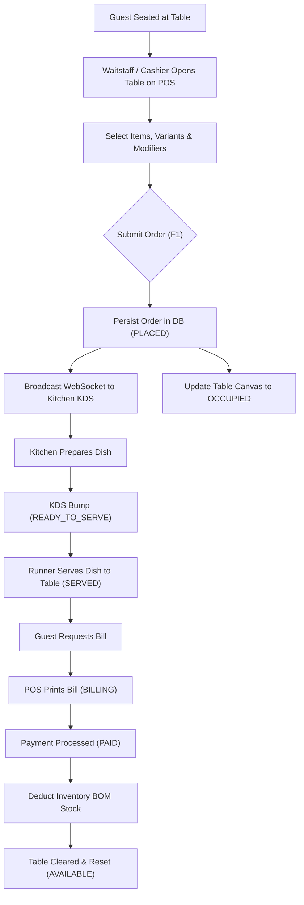
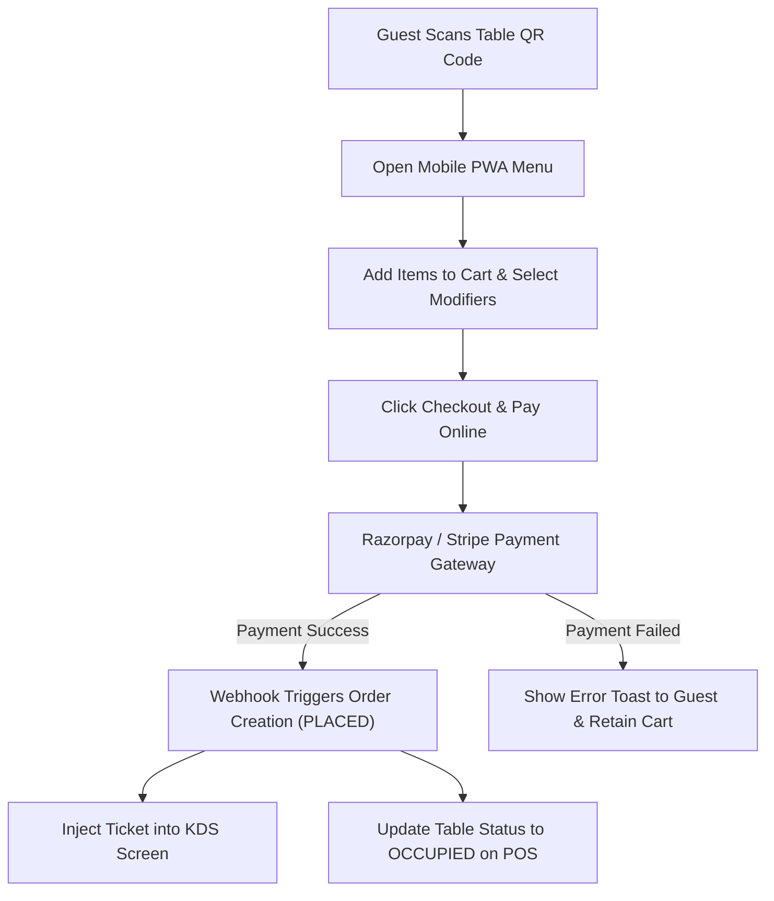
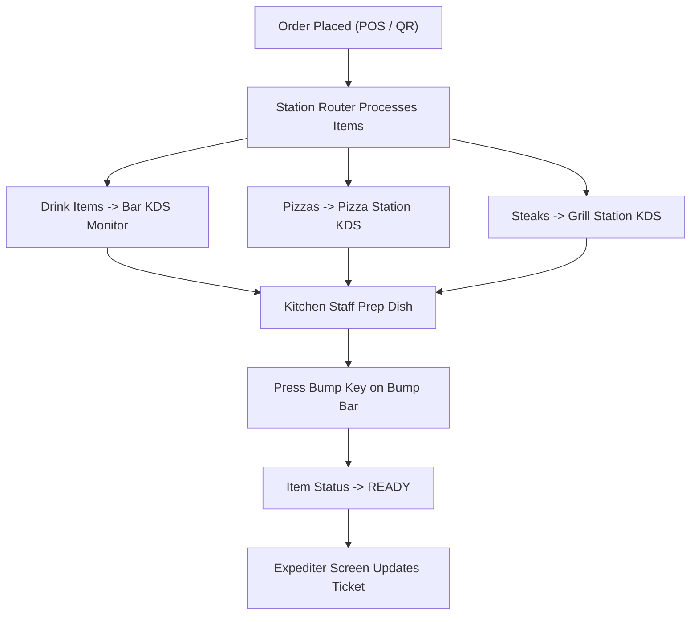
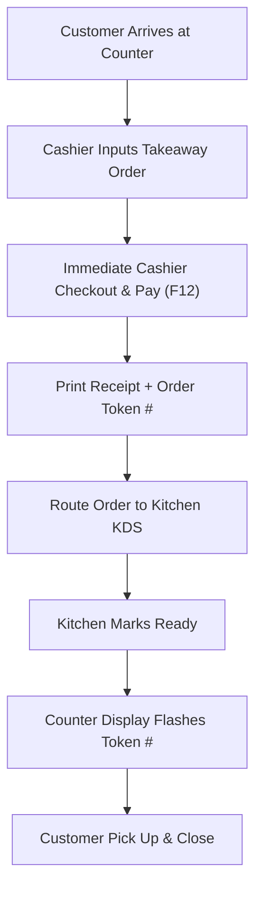
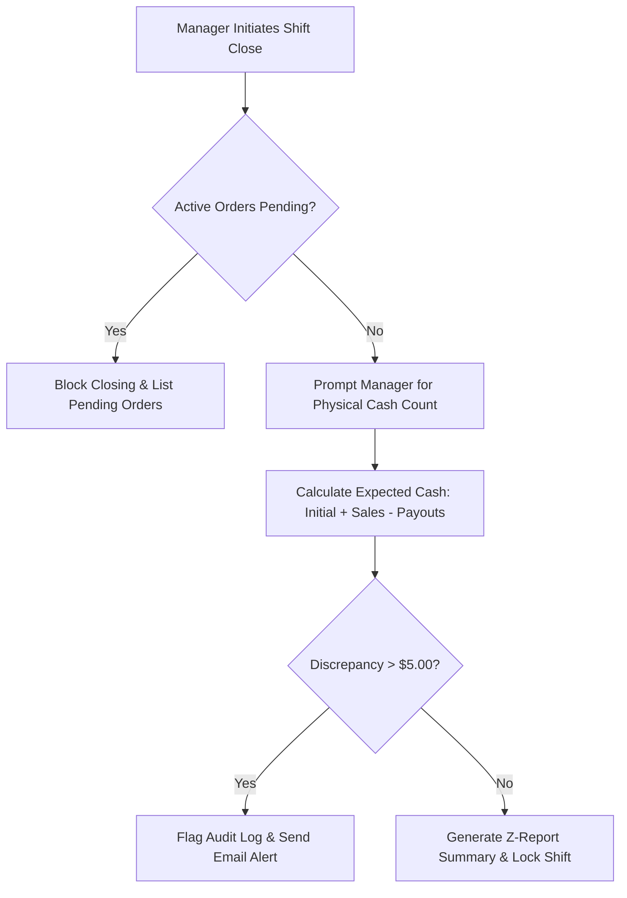
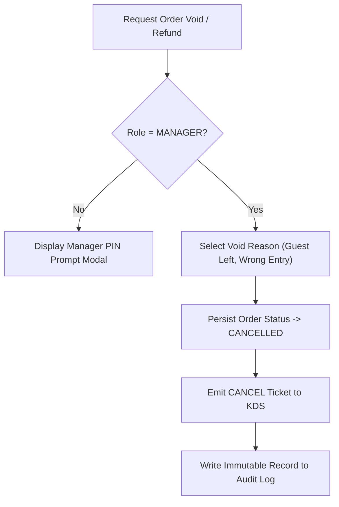

# Operational Workflow Diagrams — Trinetra v2.0

> **Document Status**: Production Specification  
> **Target Version**: v2.0.0  
> **Module Priority**: Priority 1 — Restaurant OS Operational Core  
> **Related Documents**: [ORDER_LIFECYCLE.md](file:///c:/Users/ASUS/OneDrive/Desktop/Trinetra%20digital/docs/02_Restaurant/ORDER_LIFECYCLE.md), [BUSINESS_RULES.md](file:///c:/Users/ASUS/OneDrive/Desktop/Trinetra%20digital/docs/02_Restaurant/BUSINESS_RULES.md)

---

## 1. Purpose

This document provides visual, end-to-end Mermaid workflow diagrams for the 10 primary operational flows in **Trinetra Restaurant OS**.

---

## 2. Operational Workflows (Mermaid Diagrams)

### 2.1 Flow 1: Dine-In Order Lifecycle Workflow

---

### 2.2 Flow 2: QR Guest Self-Ordering & Payment Injection Workflow

---

### 2.3 Flow 3: Kitchen KDS Station Bump & Routing Workflow

---

### 2.4 Flow 4: Takeaway / Counter Quick-Service Workflow

---

### 2.5 Flow 5: Daily Shift Closing & Cash Reconciliation Workflow

---

### 2.6 Flow 6: Order Void & Refund Exception Workflow

