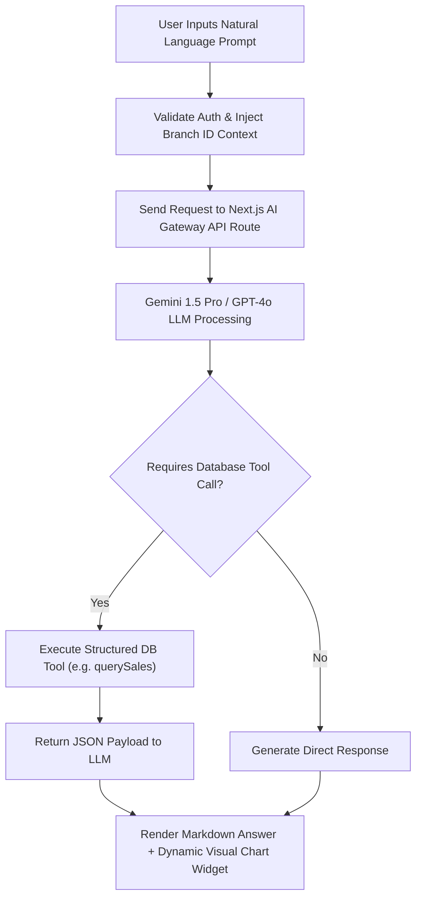

# AI Restaurant Assistant Implementation Blueprint — Trinetra v2.0

> **Document Status**: Production Specification  
> **Target Version**: v2.0.0  
> **Module Priority**: Priority 1 — AI Layer Blueprint  
> **Related Documents**: [AI_RESTAURANT_ASSISTANT.md](file:///c:/Users/ASUS/OneDrive/Desktop/Trinetra%20digital/docs/02_Restaurant/AI_RESTAURANT_ASSISTANT.md)

---

## 1. UX Flow



---

## 2. UI Layout

- Command-Style Floating AI Drawer (accessible via `Cmd+J` or Topbar AI Icon).
- Message Thread: User prompt bubbles, AI response bubbles formatted with markdown tables and embedded charts.
- Suggested Prompts Pill List (*"What was yesterday's top selling dish?"*, *"Show inventory low stock items"*).

---

## 3. Components Architecture

- `AiAssistantDrawer`: Slide-over chat container.
- `AiMessageBubble`: Rendered markdown message with code/table styling.
- `AiSuggestedPrompts`: Quick prompt selection buttons.

---

## 4. Database Tables

- Queries read-replica DB views across `orders`, `order_items`, `ingredients`.

---

## 5. API Contracts

### `POST /api/v1/ai/chat`
```json
{
  "message": "Which dish generated the most revenue last Friday?",
  "branchId": "b112233"
}
```

---

## 6. Business Rules

- **BR-AI-01**: AI assistant must strictly scope all queries to the user's active `branchId`.
- **BR-AI-02**: Financial numbers returned by AI must match database analytics exactly.

---

## 7. Edge Cases

- **Ambiguous Natural Language Query**: AI prompts user for clarification instead of guessing values.

---

## 8. Permission Rules

- `reports:financials`: Required to ask financial revenue queries.

---

## 9. Validation Rules

- User prompt must be non-empty string `< 500` characters.

---

## 10. Test Cases

- `TEST-AI-01`: Verify asking for sales data returns correct DB total and renders bar chart.

---

## 11. Failure Scenarios

- **LLM Rate Limit Exceeded**: Gracefully display fallback message *"AI Assistant is busy, please try again in a moment."*

---

## 12. Future Scalability

- Voice command input processing for hands-free kitchen and management querying.
