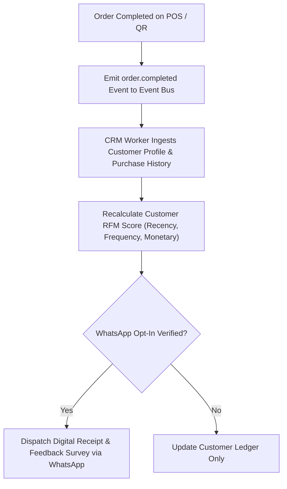

# CRM & WhatsApp Automation Implementation Blueprint — Trinetra v2.x

> **Document Status**: Strategic Architecture Blueprint (Future Expansion)  
> **Target Version**: v2.2+ (Post-Priority 1 Restaurant OS Release)  
> **Related Documents**: [CRM_VISION.md](file:///c:/Users/ASUS/OneDrive/Desktop/Trinetra%20digital/docs/11_CRM/CRM_VISION.md)

---

## 1. UX Flow



---

## 2. UI Layout

- Customer Profile Directory: Table showing guest name, visit count, lifetime spend, favorite dishes, last visit date, loyalty points balance.
- WhatsApp Campaign Studio: Template message builder with variable placeholders (`{{guest_name}}`, `{{favorite_dish}}`).

---

## 3. Components Architecture

- `CustomerDirectoryTable`: Paginated guest directory.
- `RfmSegmentBadge`: Visual badge showing RFM category (*VIP*, *At Risk*, *New*).
- `WhatsAppMessagePreview`: Live phone screen mockup displaying template message.

---

## 4. Database Tables

- `customers` (id, branch_id, name, phone, email, lifetime_spend_cents, visit_count)
- `loyalty_transactions` (id, customer_id, points_earned, points_redeemed)

---

## 5. API Contracts

### `POST /api/v1/crm/whatsapp/broadcast`
```json
{
  "branchId": "b112233",
  "segment": "VIP_GUESTS",
  "templateId": "tmpl_reengage_20"
}
```

---

## 6. Business Rules

- **BR-CRM-01**: WhatsApp messages must strictly comply with Meta WhatsApp Business API template approvals and guest opt-in rules.

---

## 7. Edge Cases

- **Invalid Phone Number**: Failed WhatsApp message logs failure status without crashing background event processing.

---

## 8. Permission Rules

- `crm:manage`: Required to launch marketing broadcasts.

---

## 9. Validation Rules

- Customer phone numbers must be formatted in E.164 international standard (`+14155552671`).

---

## 10. Test Cases

- `TEST-CRM-01`: Verify completing an order updates guest lifetime spend and increments visit count.

---

## 11. Failure Scenarios

- **Meta API Downtime**: Retries queued WhatsApp broadcasts using exponential backoff over 24 hours.

---

## 12. Future Scalability

- Automated AI-driven customer churn prediction and personalized re-engagement offers.
