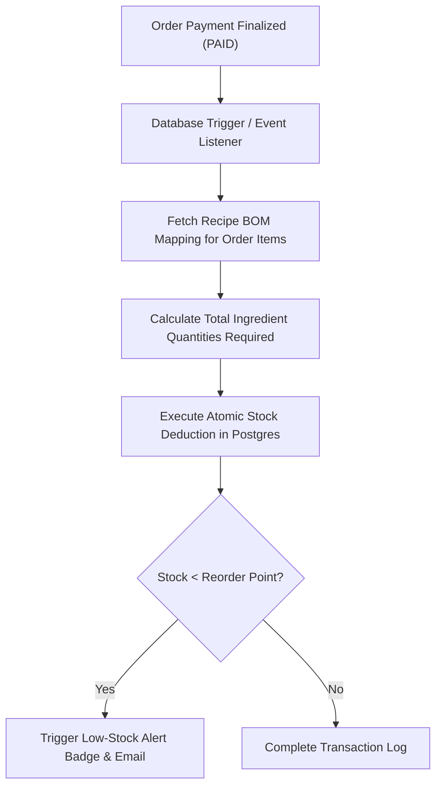

# Inventory & Recipe BOM Implementation Blueprint — Trinetra v2.0

> **Document Status**: Production Specification  
> **Target Version**: v2.0.0  
> **Module Priority**: Priority 1 — Flagship SaaS Feature Blueprint  
> **Related Documents**: [DATABASE_SCHEMA.md](file:///c:/Users/ASUS/OneDrive/Desktop/Trinetra%20digital/docs/03_Database/DATABASE_SCHEMA.md)

---

## 1. UX Flow



---

## 2. UI Layout

- Inventory Dashboard: Raw Ingredients table, Current Stock, Unit of Measure (KG, L, Units), Cost Per Unit, Reorder Point, Stock Level Badge (Green: OK, Amber: Low, Red: Out of Stock).
- Recipe Editor Modal: Link Menu Items to raw ingredients with precise quantity multipliers.

---

## 3. Components Architecture

- `IngredientDataTable`: Paginated table showing current stock levels.
- `RecipeBomEditor`: Form interface mapping raw ingredients to menu dishes.
- `PurchaseOrderModal`: Interface for generating supplier reorder forms.

---

## 4. Database Tables

- `ingredients` (id, branch_id, name, unit_of_measure, current_stock, reorder_point)
- `recipe_boms` (id, menu_item_id, ingredient_id, quantity_used)

---

## 5. API Contracts

### `POST /api/v1/inventory/adjustments`
```json
{
  "ingredientId": "ing_112233",
  "adjustmentAmount": -2.5,
  "reason": "Wastage / Spoilage",
  "notes": "Dropped tray in kitchen"
}
```

---

## 6. Business Rules

- **BR-INV-01**: Stock deductions occur atomically inside the POS payment database transaction.
- **BR-INV-02**: Negative inventory balances generate an alert log entry without blocking order completion.

---

## 7. Edge Cases

- **Item with zero BOM recipe**: System completes order checkout cleanly without attempting stock deduction.

---

## 8. Permission Rules

- `inventory:view`: Required to view stock levels.
- `inventory:adjust`: Required to perform manual adjustments.

---

## 9. Validation Rules

- `quantity_used` in BOM must be positive decimal `> 0.000`.

---

## 10. Test Cases

- `TEST-INV-01`: Selling 2x Margherita Pizzas deducts 300g Cheese (150g per pizza) from inventory atomically.

---

## 11. Failure Scenarios

- **Database Transaction Lock Timeout**: Retry stock deduction up to 3 times before logging to dead-letter queue.

---

## 12. Future Scalability

- Automated Purchase Order creation and direct email integration with registered suppliers.
