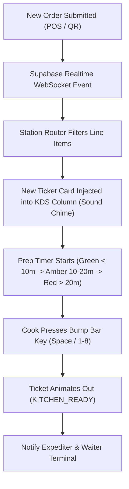

# Kitchen Display System (KDS) Implementation Blueprint — Trinetra v2.0

> **Document Status**: Production Specification  
> **Target Version**: v2.0.0  
> **Module Priority**: Priority 1 — Flagship SaaS Feature Blueprint  
> **Related Documents**: [KITCHEN_DISPLAY_SYSTEM.md](file:///c:/Users/ASUS/OneDrive/Desktop/Trinetra%20digital/docs/02_Restaurant/KITCHEN_DISPLAY_SYSTEM.md)

---

## 1. UX Flow



---

## 2. UI Layout

- Fullscreen grid layout displaying up to 8 active order ticket columns.
- Header bar: Active Station Name (`GRILL`), Total Active Tickets count, Average Prep Time KPI.
- Ticket Card: Header (Order #, Table Label, Elapsed Timer Badge), Item List (Qty, Item Name, Modifiers highlighted in red/amber), Footer (Bump Button with Hotkey hint).

---

## 3. Components Architecture

- `KdsGridShell`: Responsive flex/grid ticket column container.
- `KdsTicketHeader`: Displays ticket ID, table name, elapsed prep timer badge.
- `KdsItemRow`: Line item row with modifier pills.
- `BumpBarListener`: Invisible global keyboard event listener for industrial KDS keypads.

---

## 4. Database Tables

- Interacts with `order_items` (`status` column updated from `PENDING` -> `PREPARING` -> `READY`).
- Listens to `orders` and `order_items` changes via Supabase Realtime channels.

---

## 5. API Contracts

### `PATCH /api/v1/kds/tickets/:orderItemId/status`
```json
{
  "status": "READY",
  "bumpedByUserId": "u112233"
}
```

---

## 6. Business Rules

- **BR-KDS-01**: Bumped tickets remain in a 10-second local memory recall buffer (restorable via `Ctrl+Z`).
- **BR-KDS-02**: Orders exceeding 20 minutes trigger a recurring soft chime alarm until bumped.

---

## 7. Edge Cases

- **Order Item Cancellation**: If POS voids an item while active on KDS, item is animated off ticket with a red strike-through.

---

## 8. Permission Rules

- `kds:view`: Required to access KDS screen.
- `kds:ticket:update`: Required to bump tickets.

---

## 9. Validation Rules

- `status` state transition must follow: `PENDING` -> `PREPARING` -> `READY`.

---

## 10. Test Cases

- `TEST-KDS-01`: Assert ticket status change on POS reflects on KDS in `< 100ms`.
- `TEST-KDS-02`: Verify `Space` key bumps the oldest ticket column.

---

## 11. Failure Scenarios

- **WebSocket Disconnection**: KDS displays persistent warning banner and attempts exponential backoff reconnect while polling fallback API every 5s.

---

## 12. Future Scalability

- Support multi-screen expediter aggregation monitors for high-volume enterprise kitchens.
