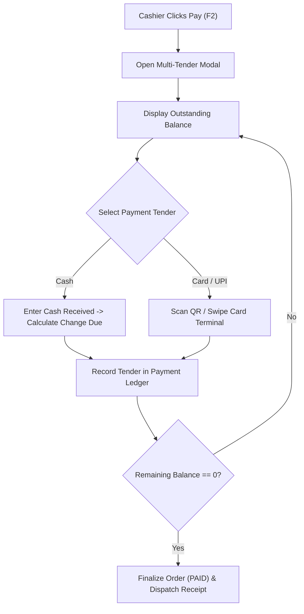

# Payments & Multi-Tender Implementation Blueprint — Trinetra v2.0

> **Document Status**: Production Specification  
> **Target Version**: v2.0.0  
> **Module Priority**: Priority 1 — Flagship SaaS Feature Blueprint  
> **Related Documents**: [POS_SYSTEM.md](file:///c:/Users/ASUS/OneDrive/Desktop/Trinetra%20digital/docs/02_Restaurant/POS_SYSTEM.md)

---

## 1. UX Flow



---

## 2. UI Layout

- Multi-Tender Payment Modal: Outstanding balance display (large monospaced typography), Quick cash amount buttons ($20, $50, $100, Exact), Payment tender list table, Change due calculation panel.

---

## 3. Components Architecture

- `MultiTenderModal`: Main checkout dialog container.
- `TenderRowList`: Table displaying recorded tenders (Cash, Card, UPI).
- `CashCalculator`: Numeric keypad for calculating change.

---

## 4. Database Tables

- `payments` (id, order_id, payment_method, amount_cents, transaction_ref, created_at)

---

## 5. API Contracts

### `POST /api/v1/payments/process`
```json
{
  "orderId": "ord_998877",
  "tenders": [
    { "method": "CASH", "amountCents": 1000 },
    { "method": "CARD", "amountCents": 1376, "transactionRef": "tx_card998" }
  ]
}
```

---

## 6. Business Rules

- **BR-PAY-01**: Sum of tender amounts must equal or exceed `totalAmountCents`.
- **BR-PAY-02**: All monetary amounts processed as integer minor units (cents).

---

## 7. Edge Cases

- **Card Payment Failure**: Modal retains cash tenders already applied and prompts cashier for alternative payment method.

---

## 8. Permission Rules

- `pos:order:pay`: Mandatory permission required to submit payments.

---

## 9. Validation Rules

- `amountCents` must be positive integer `> 0`.

---

## 10. Test Cases

- `TEST-PAY-01`: Verify cash tender of $30 on $23.76 bill correctly displays $6.24 change due.

---

## 11. Failure Scenarios

- **Payment Gateway API Error**: Rollback unconfirmed card tender and retain draft order state.

---

## 12. Future Scalability

- Direct Web Terminal Integration with Pax/Verifone card readers via local IP network protocols.
