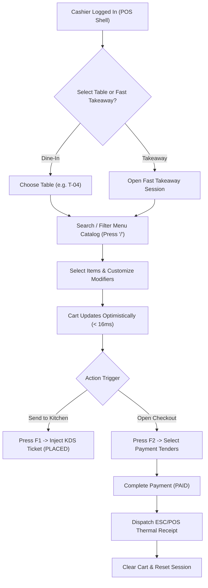

# POS Billing System Detailed Implementation Blueprint — Trinetra v2.0

> **Document Status**: Production Specification  
> **Target Version**: v2.0.0  
> **Module Priority**: Priority 1 — Flagship SaaS Feature Blueprint  
> **Related Documents**: [POS_SYSTEM.md](file:///c:/Users/ASUS/OneDrive/Desktop/Trinetra%20digital/docs/02_Restaurant/POS_SYSTEM.md), [DATABASE_SCHEMA.md](file:///c:/Users/ASUS/OneDrive/Desktop/Trinetra%20digital/docs/03_Database/DATABASE_SCHEMA.md)

---

## 1. UX Flow



---

## 2. UI Layout

Split-screen high-efficiency design:
- **Left Zone (65% width)**: Search bar (`/`), Category tabs (`Hotkeys 1-9`), Item Grid (60 FPS virtualized scrolling, stock badges).
- **Right Zone (35% width)**: Order header (Table ID, Order Type), Active Cart Itemized List (Qty steppers `+`/`-`, modifier sub-rows), Financial Breakdown (Subtotal, Tax, Discounts, Grand Total in integer cents), Action Dock (`F1 Send KDS`, `F2 Pay`, `F8 Discount`).

---

## 3. Components Architecture

- `PosLayoutShell`: Fullscreen container hiding browser chrome.
- `CatalogSearchInput`: Auto-focused search input with `/` shortcut listener.
- `CategoryTabList`: Horizontal scrolling category list with hotkey badges.
- `MenuItemCard`: Item grid node with stock status indicator.
- `ModifierSelectionModal`: Modal for mandatory/optional add-ons.
- `CartPane`: Active cart list with quantity steppers.
- `CheckoutModal`: Split tender selection modal (`Cash`, `Card`, `UPI`).

---

## 4. Database Tables

Primarily interacts with:
- `orders` (id, branch_id, table_id, status, subtotal_cents, tax_cents, discount_cents, total_amount_cents)
- `order_items` (id, order_id, menu_item_id, quantity, unit_price_cents, totalPriceCents, modifiers_json, status)
- `payments` (id, order_id, payment_method, amount_cents, transaction_ref)

---

## 5. API Contracts

### `POST /api/v1/pos/orders`
#### Request Payload (Zod Verified)
```json
{
  "branchId": "b1234567-89ab-cdef-0123-456789abcdef",
  "tableId": "t4455667-89ab-cdef-0123-456789abcdef",
  "orderType": "DINE_IN",
  "items": [
    {
      "menuItemId": "m9988776-89ab-cdef-0123-456789abcdef",
      "quantity": 1,
      "selectedModifiers": ["mopt_1122"],
      "notes": "Extra crispy crust"
    }
  ]
}
```

---

## 6. Business Rules

- **BR-POS-01**: Monetary figures must be integer minor units (cents/paise).
- **BR-POS-02**: Cart total must update instantly in client memory before server persistence.
- **BR-POS-03**: Bill discounts > 10% require manager PIN override.

---

## 7. Edge Cases

- **Item out-of-stock mid-order**: If another user 86s an item while in active cart, POS highlights item in red on checkout attempt and prevents submission.
- **Network Disconnection**: Active cart buffers to IndexedDB automatically.

---

## 8. Permission Rules

- `pos:order:create`: Required to initiate cart and submit to KDS.
- `pos:order:pay`: Required to process payments and close bill.
- `pos:order:discount`: Required to apply discounts.

---

## 9. Validation Rules

- `quantity` must be positive integer `> 0`.
- `tableId` is mandatory for `DINE_IN`, null for `TAKEAWAY`.

---

## 10. Test Cases

- `TEST-POS-01`: Verify pressing `/` focuses catalog search field.
- `TEST-POS-02`: Verify split payment summing $10 Cash + $13.76 Card successfully completes checkout.

---

## 11. Failure Scenarios

- **Thermal Printer Offline**: Display toast alert with "Retry Print" button without duplicating payment records.

---

## 12. Future Scalability

- POS state management designed for multi-register sync per outlet via local WebSockets if internet drops.
