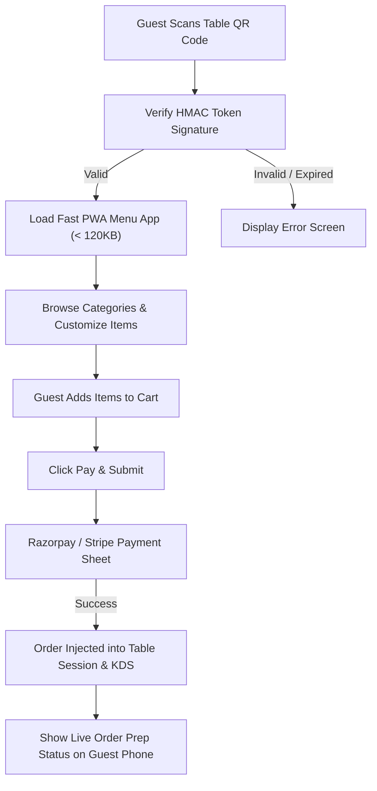

# QR Code Guest Self-Ordering Blueprint — Trinetra v2.0

> **Document Status**: Production Specification  
> **Target Version**: v2.0.0  
> **Module Priority**: Priority 1 — Flagship SaaS Feature Blueprint  
> **Related Documents**: [QR_ORDERING.md](file:///c:/Users/ASUS/OneDrive/Desktop/Trinetra%20digital/docs/02_Restaurant/QR_ORDERING.md)

---

## 1. UX Flow



---

## 2. UI Layout

- Mobile PWA layout optimized for single-hand touch interaction.
- Top Sticky Header: Restaurant Logo, Branch Name, Table Badge (e.g. `Table T-04`).
- Body: Category tabs, Item cards with high-res food images, quick `+ Add` button.
- Bottom Floating Bar: View Cart summary pill showing item count and total amount.

---

## 3. Components Architecture

- `QrMenuShell`: Responsive mobile wrapper.
- `QrCategoryList`: Horizontal category pill bar.
- `QrItemCard`: Food item card with image thumbnail and add button.
- `GuestCartDrawer`: Slide-up drawer for item customization and checkout.

---

## 4. Database Tables

- Interacts with `orders`, `order_items`, `tables`, and `payments`.

---

## 5. API Contracts

### `POST /api/v1/qr/orders`
```json
{
  "qrSignature": "a1b2c3d4...",
  "branchId": "b112233",
  "tableId": "t445566",
  "items": [
    { "menuItemId": "m998877", "quantity": 2, "selectedModifiers": [] }
  ],
  "paymentRef": "pay_rzp12345"
}
```

---

## 6. Business Rules

- **BR-QR-01**: HMAC signature prevents off-site order submissions.
- **BR-QR-02**: QR orders inject into kitchen displays with a distinct `[QR Dine-In]` badge.

---

## 7. Edge Cases

- **User loses network connection during checkout**: Guest cart persists in `localStorage` allowing retry upon connection restore.

---

## 8. Permission Rules

- Public endpoint guarded by HMAC token verification.

---

## 9. Validation Rules

- `qrSignature` must pass HMAC verification against active server secret key.

---

## 10. Test Cases

- `TEST-QR-01`: Verify invalid HMAC signature returns `403 Forbidden`.
- `TEST-QR-02`: Verify successful online payment injects order into KDS within `< 300ms`.

---

## 11. Failure Scenarios

- **Payment Gateway Webhook Timeout**: Client polls fallback verification endpoint `GET /api/v1/qr/orders/verify-payment`.

---

## 12. Future Scalability

- Guest order status updates stream via lightweight Server-Sent Events (SSE) or WebSockets directly to the browser.
