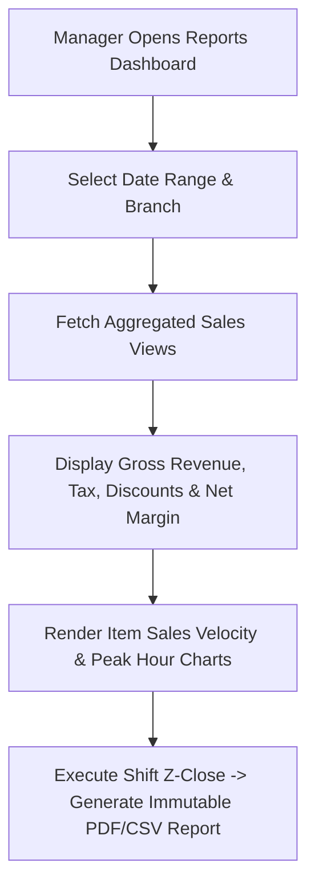

# Reports & Daily Z-Close Blueprint — Trinetra v2.0

> **Document Status**: Production Specification  
> **Target Version**: v2.0.0  
> **Module Priority**: Priority 1 — Flagship SaaS Feature Blueprint  
> **Related Documents**: [SUCCESS_CRITERIA.md](file:///c:/Users/ASUS/OneDrive/Desktop/Trinetra%20digital/docs/00_Project/SUCCESS_CRITERIA.md)

---

## 1. UX Flow



---

## 2. UI Layout

- Financial KPI Cards: Gross Sales, Net Sales, Total Orders, Average Order Value (AOV), Total Discounts.
- Interactive Charts: Revenue by Hour (Bar Chart), Sales by Category (Donut Chart), Payment Method Breakdown.
- Daily Closing Tab: Z-Report summary with print and export triggers.

---

## 3. Components Architecture

- `FinancialKpiGrid`: Grid of summary stat cards.
- `SalesVelocityChart`: Recharts/Tremor chart component.
- `ZReportModal`: Shift closing declaration dialog.

---

## 4. Database Tables

- Queries `orders`, `order_items`, `payments`, `audit_logs`.

---

## 5. API Contracts

### `GET /api/v1/reports/daily-closing?branchId=b1122&date=2026-07-31`
```json
{
  "grossSalesCents": 125000,
  "netSalesCents": 115000,
  "taxCents": 10000,
  "discountCents": 5000,
  "totalOrders": 45,
  "paymentBreakdown": { "CASH": 45000, "CARD": 80000 }
}
```

---

## 6. Business Rules

- **BR-REP-01**: Financial reports are computed strictly from `PAID` order transactions.
- **BR-REP-02**: Z-Close locks shift editing permanently.

---

## 7. Edge Cases

- **Zero Sales Day**: Reports render clean zero-state without throwing NaN division errors.

---

## 8. Permission Rules

- `reports:financials`: Required to access revenue stats.

---

## 9. Validation Rules

- `date` parameter must be valid ISO-8601 date format.

---

## 10. Test Cases

- `TEST-REP-01`: Verify Z-report sum matches total payments recorded for the shift.

---

## 11. Failure Scenarios

- **Query Timeout on Large Date Ranges**: Query uses pre-aggregated materialized views (`monthly_sales_summary`).

---

## 12. Future Scalability

- Scheduled daily automated CSV/PDF report dispatch via email to restaurant owners.
