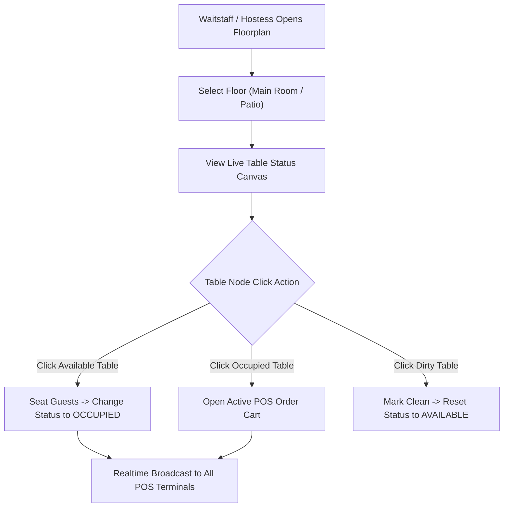

# Table Management Implementation Blueprint — Trinetra v2.0

> **Document Status**: Production Specification  
> **Target Version**: v2.0.0  
> **Module Priority**: Priority 1 — Flagship SaaS Feature Blueprint  
> **Related Documents**: [TABLE_MANAGEMENT.md](file:///c:/Users/ASUS/OneDrive/Desktop/Trinetra%20digital/docs/02_Restaurant/TABLE_MANAGEMENT.md)

---

## 1. UX Flow



---

## 2. UI Layout

- 2D Canvas Editor Grid (1000px x 1000px virtual canvas).
- Top Toolbar: Floor tabs, Add Table button (drag & drop), Status filter legend (Green: Available, Blue: Occupied, Amber: Billing, Red: Dirty).
- Table Nodes: Rendered with capacity badge, label, status color border, active timer counter.

---

## 3. Components Architecture

- `FloorCanvasContainer`: Responsive canvas wrapper handling drag & drop.
- `TableCanvasNode`: Individual SVG/HTML element representing a table.
- `TableTransferModal`: Dialog for moving orders between tables.

---

## 4. Database Tables

- `floors` (id, branch_id, name)
- `tables` (id, floor_id, label, capacity, shape, position_x, position_y, status)

---

## 5. API Contracts

### `PATCH /api/v1/tables/:tableId/status`
```json
{
  "status": "OCCUPIED",
  "activeOrderId": "ord_998877"
}
```

---

## 6. Business Rules

- **BR-TBL-01**: Occupied tables cannot be deleted from the floorplan.
- **BR-TBL-02**: Table transfers require destination table to be `AVAILABLE`.

---

## 7. Edge Cases

- **Concurrent Table Seating**: Optimistic concurrency control prevents two servers from opening separate sessions on the same table simultaneously.

---

## 8. Permission Rules

- `table:view`: Required to view floorplan.
- `table:manage`: Required to edit table positions/grid.

---

## 9. Validation Rules

- `position_x` and `position_y` must be within canvas bounds `(0 - 1000)`.

---

## 10. Test Cases

- `TEST-TBL-01`: Verify drag and drop updates table coordinates in DB.
- `TEST-TBL-02`: Assert changing table status updates status badge in real time.

---

## 11. Failure Scenarios

- **Canvas Render Error**: Fallback to traditional tabular list view of tables.

---

## 12. Future Scalability

- Support multi-section dining rooms across multi-level floorplans.
