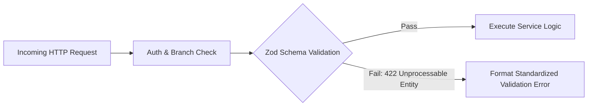
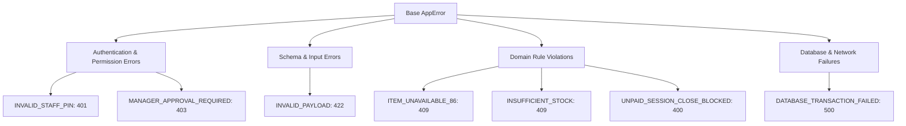
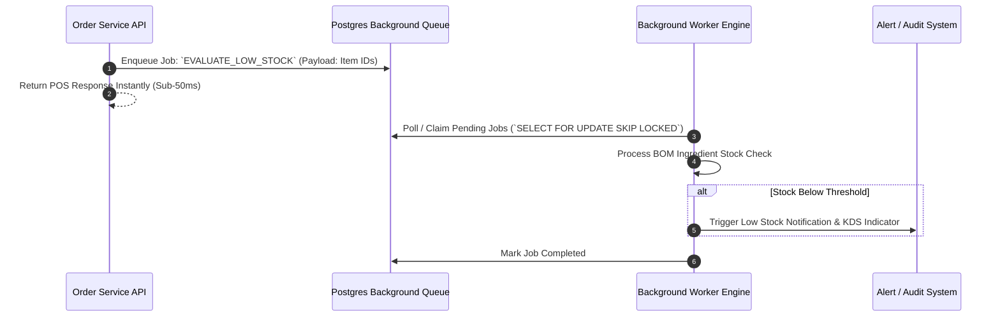
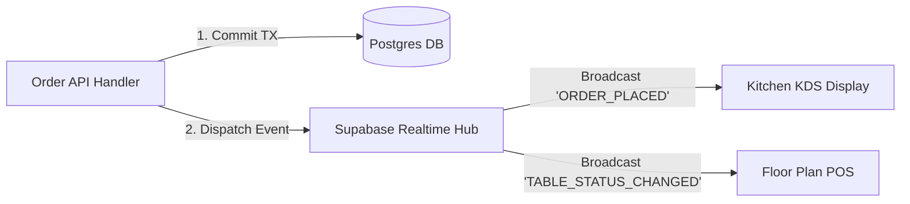

# Trinetra Restaurant OS — Backend Architecture Specification

> [!IMPORTANT]
> **Document Status**: Draft for Review (Milestone 1 — Document 4 of 8)  
> **Source of Truth Alignment**: [AGENTS.md](file:///c:/Users/ASUS/OneDrive/Desktop/Trinetra%20digital/AGENTS.md) & [docs/SYSTEM_ARCHITECTURE.md](file:///c:/Users/ASUS/OneDrive/Desktop/Trinetra%20digital/docs/SYSTEM_ARCHITECTURE.md)  
> **Note**: This document specifies service abstractions, API design, validation schemas, error taxonomy, background queues, and server event responsibilities **without executable code**.

---

## 1. Backend Service Layer & Feature Boundaries

The backend layer runs on Next.js 15 Server Infrastructure (Route Handlers & Server Actions) backed by Supabase PostgreSQL. Business logic is encapsulated inside dedicated, single-responsibility **Service Modules** isolated from HTTP controllers and UI components.

```mermaid
graph TD
    subgraph Client Touchpoints
        UI[Next.js POS / KDS / Admin Frontend]
    end

    subgraph API & Controller Layer (Next.js App Router)
        Middleware[Auth & Tenant Middleware]
        Routes[API Route Handlers /api/v1/...]
        Zod[Zod Validation Layer]
    end

    subgraph Service Abstraction Layer (Domain Services)
        S1[AuthService]
        S2[MenuService]
        S3[FloorService]
        S4[OrderService]
        S5[KitchenService]
        S6[BillingService]
        S7[InventoryService]
        S8[AuditService]
    end

    subgraph Data & Storage Layer
        DB[(Supabase PostgreSQL)]
        RT[Supabase Realtime Gateway]
    end

    UI -->|HTTPS Request| Middleware
    Middleware --> Zod
    Zod --> Routes
    Routes --> S1 & S2 & S3 & S4 & S5 & S6 & S7 & S8

    S4 -->|ACID Transaction| DB
    S5 -->|Broadcast CDC Event| RT
    S6 -->|Sequential Invoice Generation| DB
    S7 -->|Recipe BOM Auto-Deduction| DB
    S8 -->|Append Audit Event| DB
```

### Core Service Modules & Responsibilities

| Service Module | Responsibilities | Key Dependencies |
|----------------|------------------|------------------|
| **`AuthService`** | Verifies administrative credentials and 4-digit Staff Quick PINs; issues branch-scoped session claims. | Supabase Auth, `StaffRepository` |
| **`BranchService`** | Manages operating hours, GSTIN, FSSAI numbers, tax modes, and receipt print header configurations. | `BranchRepository` |
| **`MenuService`** | Handles categories, items, modifier groups, and realtime "86'd" (unavailable) toggles. | `MenuRepository`, `InventoryService` |
| **`FloorService`** | Manages zones, table seating states, capacity metadata, and table status transitions. | `TableRepository`, `SessionService` |
| **`SessionService`** | Manages customer session lifecycles (Dine-in and Takeaway), guest count entries, and table assignment. | `SessionRepository`, `TableService` |
| **`OrderService`** | Validates order entries, handles line items, modifiers, item notes, item cancellations, voids, and comps. | `OrderRepository`, `KitchenService`, `InventoryService`, `AuditService` |
| **`KitchenService`** | Constructs KDS tickets, manages preparation statuses (`placed` → `preparing` → `ready`), formats print streams. | `KitchenRepository`, Realtime Broadcast |
| **`BillingService`** | Calculates CGST/SGST taxes, applies manager-approved discounts, manages split bills, records payments, and locks sequential invoices. | `BillingRepository`, `OrderService`, `AuditService` |
| **`InventoryService`** | Maps recipe BOMs, executes automated ingredient stock-outs upon fulfillment, logs waste, and flags low stock alerts. | `InventoryRepository`, `MenuService` |
| **`AuditService`** | Appends immutable audit log entries for all financial mutations, voids, comps, and administrative overrides. | `AuditRepository` |

---

## 2. API Strategy & Endpoint Design Conventions

The backend exposes a clean, versioned, RESTful JSON API under `/api/v1/branches/[branchId]/`.

### Standardized Response Contract

Every API response follows a strict, predictable JSON wrapper:

#### Success Response Envelope
```json
{
  "success": true,
  "data": { ... },
  "meta": {
    "timestamp": "2026-08-04T10:45:00.000Z",
    "branchId": "123e4567-e89b-12d3-a456-426614174000",
    "version": "v1"
  }
}
```

#### Error Response Envelope
```json
{
  "success": false,
  "error": {
    "code": "ITEM_UNAVAILABLE",
    "message": "Paneer Tikka is currently 86'd (sold out) by the kitchen.",
    "details": { "itemId": "987f6543-e89b-12d3-a456-426614174999" },
    "requestId": "req_abc123xyz"
  },
  "meta": {
    "timestamp": "2026-08-04T10:45:00.000Z",
    "branchId": "123e4567-e89b-12d3-a456-426614174000"
  }
}
```

### Idempotency Control
For payment processing and order submissions, clients MUST provide an `X-Idempotency-Key` header (UUID v4). The backend verifies this key against an idempotency store to prevent accidental double-billing or duplicate order creation during network retries.

---

## 3. Input Validation Strategy

Validation is strictly enforced at the API Gateway layer using **Zod schemas** before any service logic or database interaction executes.



### Mandatory Validation Policies
1. **Strict Type Safety**: Query params, URL parameters, request bodies, and headers are parsed and typed via Zod.
2. **Numeric Boundaries**: Quantities must be positive integers (`quantity >= 1`), prices and tax rates non-negative (`amount >= 0`).
3. **String Sanitization**: Notes and text inputs are stripped of HTML/script tags to prevent XSS.
4. **GSTIN / FSSAI Formatting**: Validated via strict regex patterns (e.g., 15-character GSTIN format for India).

---

## 4. Error Handling Architecture & Taxonomy

Errors are classified using a standardized application error hierarchy to prevent internal database errors or stack traces from leaking to clients.



### Standardized Error Taxonomy

| Error Code | HTTP Status | Domain Context | User-Facing Explanation |
|------------|-------------|----------------|-------------------------|
| `INVALID_STAFF_PIN` | `401 Unauthorized` | Auth | Incorrect 4-digit staff PIN. Access denied. |
| `FORBIDDEN_ROLE` | `403 Forbidden` | RBAC | Staff member role does not have permission for this action. |
| `MANAGER_APPROVAL_REQUIRED` | `403 Forbidden` | POS / Billing | This discount/void exceeds threshold and requires Manager PIN. |
| `TABLE_ALREADY_OCCUPIED` | `409 Conflict` | Floor | This table already has an active session. |
| `ITEM_UNAVAILABLE_86` | `409 Conflict` | Menu / POS | Cannot add item. The kitchen marked this item as sold out. |
| `ORDER_ALREADY_CLOSED` | `400 Bad Request` | POS | Cannot modify an order that has already been billed and closed. |
| `UNPAID_SESSION_CLOSE_BLOCKED` | `400 Bad Request` | Billing | Cannot close table session while unpaid balance remains > ₹0.00. |
| `INSUFFICIENT_STOCK` | `409 Conflict` | Inventory | Ingredient stock is below required recipe BOM quantity. |
| `DUPLICATE_IDEMPOTENCY_KEY` | `409 Conflict` | System | This transaction was already processed. |

---

## 5. Background Jobs & Asynchronous Processing

While high-speed POS requests execute synchronously, secondary tasks are processed asynchronously via a lightweight, persistent **Background Job Queue** (`background_jobs` table backed by PostgreSQL cron/triggers).



### Background Job Use Cases
1. **Low Stock Evaluation**: Checks ingredient balances against thresholds after order fulfillments.
2. **EOD Daily Sales Aggregation**: Computes daily sales metrics, GST summaries, and payment breakdowns at branch closing time.
3. **Stale Session Housekeeping**: Identifies open sessions exceeding 6 hours without activity and flags them for manager review.
4. **Audit Trail Archival & Processing**: Enriches audit events with geo/device metadata asynchronously.

---

## 6. Server Realtime Responsibilities

The backend server acts as the primary publisher for Supabase Realtime WebSocket events.

### Server Event Dispatch Rules
- **Event Source**: API route handlers publish events immediately following successful database transaction commits.
- **Event Scope**: Every broadcast specifies `tenant_id` and `branch_id` to prevent cross-restaurant event leaks.
- **Payload Design**: Broadcast payloads include only essential operational data (Order ID, Table Number, Status, Item Summary) to keep WebSocket message sizes minimal (< 2KB).



---

## 7. Architectural Summary

This `BACKEND_ARCHITECTURE.md` document specifies the complete server-side operational framework:
- Defines 10 modular services isolating core business logic from Next.js routes.
- Establishes a standardized, versioned RESTful API contract with idempotency guards.
- Enforces strict Zod runtime schema validation on 100% of input endpoints.
- Maps a domain-specific error taxonomy with clear HTTP status codes.
- Outlines asynchronous background job queues for non-blocking operations.
- Formalizes server-side realtime event dispatch rules for fast POS/KDS updates.

---

> [!NOTE]
> **Next Recommended Step**: Upon approval of this document, we will proceed to **Document 5 of 8: `FRONTEND_ARCHITECTURE.md`** to outline component hierarchy, state management, routing, and UI boundaries without writing React code.
