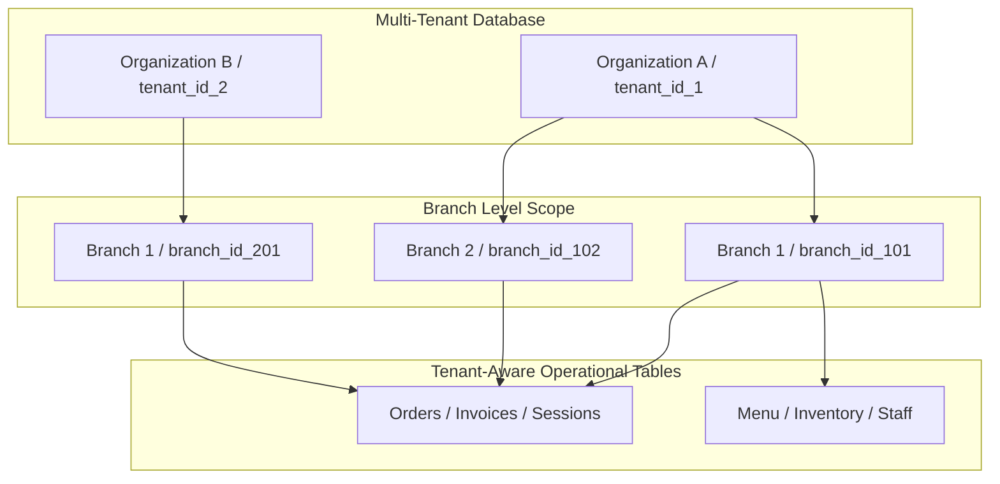
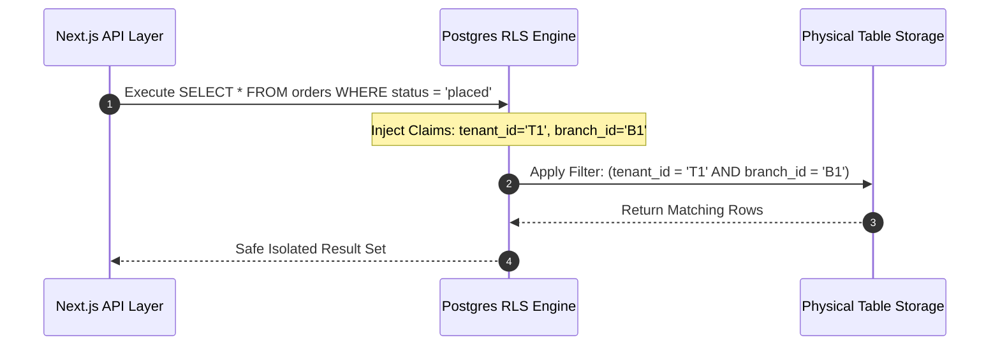
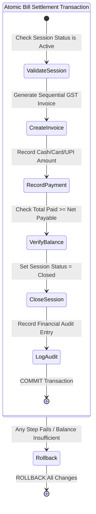
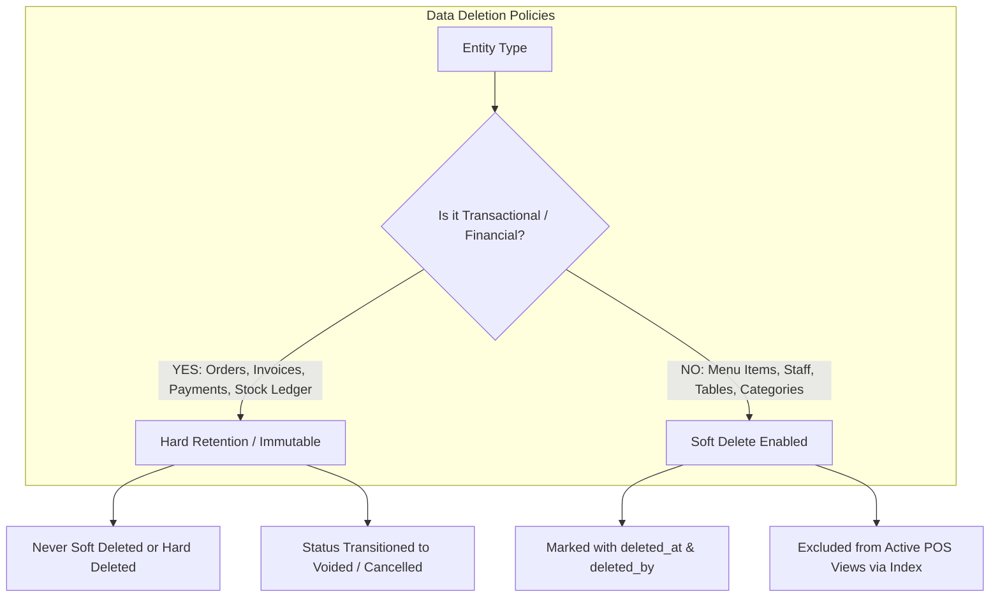
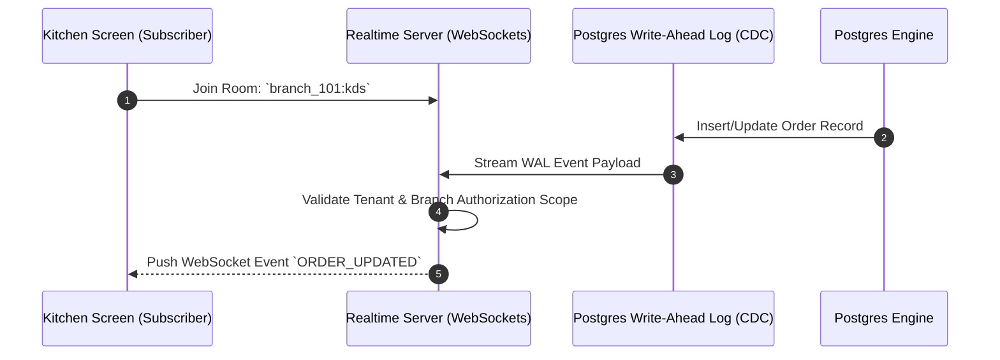

# Trinetra Restaurant OS — Database Strategy Specification

> [!IMPORTANT]
> **Document Status**: Draft for Review (Milestone 1 — Document 3 of 8)  
> **Source of Truth Alignment**: [AGENTS.md](file:///c:/Users/ASUS/OneDrive/Desktop/Trinetra%20digital/AGENTS.md) & [docs/SYSTEM_ARCHITECTURE.md](file:///c:/Users/ASUS/OneDrive/Desktop/Trinetra%20digital/docs/SYSTEM_ARCHITECTURE.md)  
> **Note**: This document outlines architectural database policies, tenant/branch isolation logic, security model, and transaction boundaries **without executable DDL or SQL code**.

---

## 1. Database Philosophy & Core Principles

Trinetra Restaurant OS relies on PostgreSQL managed via Supabase as its single source of operational truth.

### Core Architectural Principles
1. **Relational Integrity Over Application Logic**: Foreign key constraints, unique constraints, and check constraints enforce valid data states directly inside the database engine.
2. **Zero Silently Assumed Mutations**: All mutations affecting financial numbers (billing, discounts, voids) or inventory balances must execute within explicit ACID transactions.
3. **Immutable History**: Operational transactions (orders, payments, audit events, stock movements) are append-only or versioned. Historical records are never deleted or mutated in-place.
4. **Defense-in-Depth Multi-Tenancy**: Data access is governed at the PostgreSQL engine level using Row Level Security (RLS), preventing cross-tenant or cross-branch data leakage even if application-level filters fail.

---

## 2. Multi-Tenant & Multi-Branch Isolation Strategy

The database architecture employs a **Shared Database, Shared Schema, Discriminator Column** multi-tenancy model enhanced with two-tier hierarchy:

### Discriminator Requirements
- **Tenant Scope (`tenant_id`)**: A non-nullable UUID column present on **100% of operational tables**, linking records to the top-level Organization.
- **Branch Scope (`branch_id`)**: A non-nullable UUID column present on **all operational & branch-specific tables**, linking records to a physical location.
- **Root Exceptions**: Global lookup tables (e.g., system roles, units of measurement definitions) are system-scoped and read-only to tenants.

---

## 3. Row Level Security (RLS) Strategy

Row Level Security is enabled on **every database table without exception**. 

### RLS Claim Propagation
1. **JWT Custom Claims**: When a staff member authenticates (or enters a Quick PIN), the resulting session context injects runtime claims into the database session:
   - `request.jwt.claims.tenant_id`
   - `request.jwt.claims.branch_id`
   - `request.jwt.claims.user_role`

2. **Policy Evaluation Rules**:
   - **SELECT Policy**: `tenant_id = current_tenant_id AND (branch_id = current_branch_id OR user_role = 'owner')`
   - **INSERT Policy**: `tenant_id = current_tenant_id AND branch_id = current_branch_id`
   - **UPDATE Policy**: `tenant_id = current_tenant_id AND branch_id = current_branch_id AND role_has_permission(user_role, action)`
   - **DELETE Policy**: Disabled for transactional tables. Restricted to `owner` for master configuration items.

### Performance Optimization for RLS
To prevent performance degradation during nested queries:
- Security definer helper functions parse JWT claims cleanly without re-querying the `users_roles` table on every row.
- RLS evaluation relies strictly on indexed columns (`tenant_id`, `branch_id`).

---

## 4. Transaction Strategy & Concurrency Control

Restaurant operations require atomic operations across multiple tables simultaneously. 

### Critical Multi-Table Transactions

| Workflow | Tables Involved | Atomic Guarantee Requirement |
|----------|-----------------|------------------------------|
| **Order Entry** | `orders`, `order_items`, `table_sessions`, `order_events` | Order creation + Item additions + Table status update + Audit event commit together or fail together. |
| **Kitchen Fulfillment** | `orders`, `inventory_stock`, `stock_movements` | Marking order ready updates status + auto-deducts recipe BOM ingredients + writes stock movement ledger atomically. |
| **Bill Settlement** | `table_sessions`, `invoices`, `payments`, `audit_logs` | Recording payment + generating sequential invoice + closing session + logging financial audit occurs in a single transaction. |
| **Item Cancellation / Void** | `orders`, `order_items`, `waste_records`, `audit_logs` | Voiding item updates order total + logs waste quantity + records manager PIN approval in audit trail. |

### Concurrency Control Model
- **Pessimistic Locking (`SELECT FOR UPDATE`)**: Used during sequential invoice number generation to guarantee zero gaps or duplicate invoice numbers under peak payment concurrency.
- **Optimistic Concurrency Control (OCC)**: Used for order updates via an incremental `version` field. If two waiters edit the same table's order simultaneously, the second mutation detects a version mismatch and prompts a refresh.

---

## 5. Audit Strategy & Immutability Architecture

Financial accountability requires a tamper-evident, append-only record of system changes.

### Audit Design Rules
1. **Immutable Audit Table (`audit_logs`)**: Stores every financial or administrative mutation with fields:
   - `tenant_id`, `branch_id`
   - `entity_type` (e.g., `Order`, `Invoice`, `Discount`, `Inventory`)
   - `entity_id`
   - `actor_id`, `actor_role`
   - `action` (e.g., `VOID_ITEM`, `APPLY_DISCOUNT`, `COMP_ITEM`, `CANCEL_ORDER`)
   - `old_value` (JSONB snapshot)
   - `new_value` (JSONB snapshot)
   - `reason_text`
   - `created_at` (Database timestamp `now()`)

2. **Master Data Snapshotting**: Invoices and order line items store **copies** of item names, prices, and tax rates at the exact moment of order entry/billing. Changing a menu item price tomorrow **never** alters historical invoices or reports.

---

## 6. Soft Delete & Data Retention Policy

To preserve financial audit trails and historical reporting integrity, data retention follows a strict dual policy:

### Policy Rules
- **Configuration & Master Data**: Menu items, staff accounts, tables, and categories use Soft Delete (`deleted_at`, `deleted_by`). Soft-deleted items are hidden from POS entry but retained for historical order reference.
- **Transactional & Financial Data**: Orders, line items, invoices, payments, audit logs, and inventory movements **NEVER** use soft delete. Voided or cancelled transactions remain as explicit permanent records with status flags.

---

## 7. Indexing Strategy for High Concurrency

To ensure sub-50ms query execution across POS and KDS screens, indexes are designed with strict compound prefixing:

### Index Design Guidelines

1. **Compound Tenant/Branch Prefix**:
   - Every secondary index begins with `(tenant_id, branch_id, ...)`. This forces PostgreSQL to isolate query scans to a single branch immediately.

2. **Partial Indexes for Active Workloads**:
   - Active Sessions: Index on `(tenant_id, branch_id, table_id) WHERE status = 'active'`
   - KDS Orders: Index on `(tenant_id, branch_id, created_at) WHERE status IN ('placed', 'accepted', 'preparing')`
   - Low Stock Items: Index on `(tenant_id, branch_id) WHERE current_stock <= low_stock_threshold`

3. **Search & Trigram Indexes**:
   - Menu item and customer phone searches utilize GIN trigram indexes (`gin_trgm_ops`) for fast prefix/fuzzy matching.

---

## 8. Realtime Engine Strategy (Postgres CDC)

Realtime synchronization between POS terminals and Kitchen Displays relies on PostgreSQL Change Data Capture (CDC) via Supabase Realtime.

### Realtime Security & Topic Scoping
- **Channel Namespacing**: Realtime channels are strictly scoped by branch UUID: `realtime:tenant_id:branch_id:channel_name`.
- **Payload Sanitization**: Webhook and WebSocket payloads omit sensitive authentication hashes (e.g., staff PINs) to prevent data exposure over client sockets.

---

## 9. Architectural Summary

This `DATABASE_STRATEGY.md` document provides a robust blueprint for data persistence in Trinetra Restaurant OS:
- Guarantees multi-tenant & multi-branch isolation via compulsory discriminator columns and PostgreSQL RLS.
- Enforces ACID transaction boundaries across order entry, kitchen prep, BOM stock deductions, and bill settlements.
- Preserves complete financial integrity through append-only audit logs and immutable invoice snapshots.
- Optimizes query speed with branch-prefixed compound indexes and active-workload partial indexes.
- Delivers secure, branch-isolated realtime events via Postgres CDC.

---

> [!NOTE]
> **Next Recommended Step**: Upon approval of this document, we will proceed to **Document 4 of 8: `BACKEND_ARCHITECTURE.md`** to formalize service boundaries, API specifications, validation schemas, error handling, and background processing without writing implementation code.
