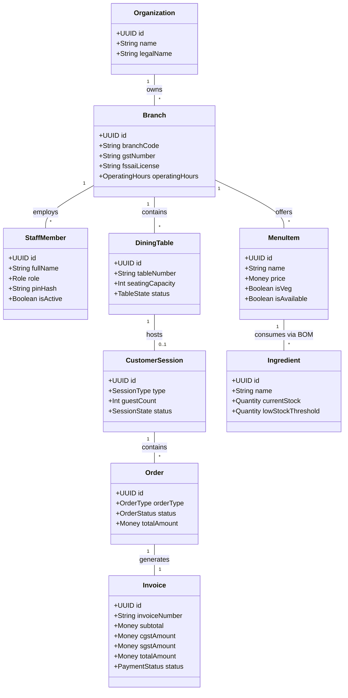
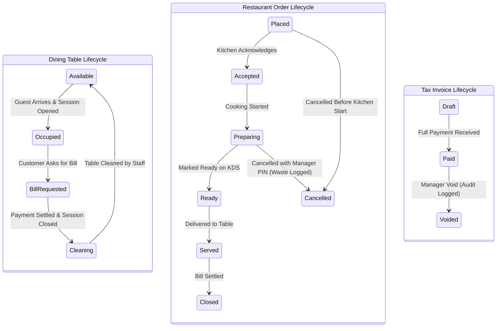

# Trinetra Restaurant OS — Domain Model Specification

> [!IMPORTANT]
> **Document Status**: Draft for Review (Milestone 1 — Document 2 of 8)  
> **Source of Truth Alignment**: [AGENTS.md](file:///c:/Users/ASUS/OneDrive/Desktop/Trinetra%20digital/AGENTS.md) & [docs/SYSTEM_ARCHITECTURE.md](file:///c:/Users/ASUS/OneDrive/Desktop/Trinetra%20digital/docs/SYSTEM_ARCHITECTURE.md)  
> **Note**: This document uses Domain-Driven Design (DDD) principles. It defines pure business concepts, domain aggregates, entity relationships, lifecycles, and operational rules **without SQL or database table definitions**.

---

## 1. Domain Overview & Aggregate Boundaries

The domain is partitioned into 7 core Domain Aggregates:
1. **Organization & Branch Aggregate** (Root tenant and location governance)
2. **Staff & Identity Aggregate** (Staff credentials, roles, PINs, and active terminal contexts)
3. **Catalog Aggregate** (Categories, items, modifier groups, and availability states)
4. **Floor & Session Aggregate** (Zones, tables, seating states, and customer sessions)
5. **Order & Fulfillment Aggregate** (Orders, line items, kitchen tickets, status transitions)
6. **Billing & Financial Aggregate** (Invoices, tax breakdowns, discounts, payment settlements)
7. **Inventory & Recipe Aggregate** (Ingredients, Units of Measurement, BOM recipes, stock movements, waste)

---

## 2. Entity Specifications by Domain Aggregate

### 2.1 Organization & Branch Aggregate

#### Entity: `Organization` (Root Aggregate)
- **Responsibility**: Represents the commercial business entity or brand operating the restaurant.
- **Attributes**: Unique Identity, Commercial Name, Legal Name, Primary Contact Email/Phone, Status (`Active`, `Suspended`).
- **Ownership**: Top-level parent of all branches, staff, menus, and financial records.
- **Business Rules**: Cannot be deleted if active branches or financial records exist.

#### Entity: `Branch`
- **Responsibility**: Represents a physical restaurant facility operating within an Organization.
- **Attributes**: Unique Identity, Branch Name, Address, City, State, Pin Code, GSTIN (15-digit), FSSAI License Number (14-digit), Operating Hours, Currency Code (`INR`), Tax Mode (`Inclusive`, `Exclusive`).
- **Ownership**: Belongs to `Organization`. Owns all branch-specific staff, tables, sessions, inventory, and invoices.
- **Lifecycle**: `Draft` → `Active` → `Closed` / `Archived`.
- **Business Rules**: 
  - All operational queries and transactions MUST be scoped to a specific `Branch`.
  - GSTIN and FSSAI license numbers are required before issuing invoices.

---

### 2.2 Staff & Identity Aggregate

#### Entity: `StaffMember`
- **Responsibility**: Represents an employee authorized to operate POS terminals, manage floors, prepare food, or perform inventory entries.
- **Attributes**: Unique Identity, Full Name, Phone Number, Role (`Owner`, `Manager`, `Cashier`, `Waiter`, `KitchenStaff`, `InventoryManager`), 4-to-6 Digit Hashed Terminal PIN, Employment Status (`Active`, `Inactive`).
- **Ownership**: Belongs to a specific `Branch` (or multiple branches under the same `Organization` for owners).
- **Lifecycle**: `Invited` → `Active` → `Suspended` → `Terminated`.
- **Business Rules**:
  - PIN numbers must be unique within a single `Branch`.
  - Waiters and Cashiers authenticate using Terminal PIN for fast POS operations.
  - Deactivating a staff member immediately revokes active PIN login sessions.

#### Entity: `StaffTerminalSession`
- **Responsibility**: Tracks transient active staff identity on a shared POS terminal device.
- **Attributes**: Session Identity, Device Identifier, Active Staff Member, Session Start Time, Last Active Time, Auto-lock Status.
- **Lifecycle**: `Authenticated` → `Locked` → `Terminated`.

---

### 2.3 Catalog Aggregate (Menu & Products)

#### Entity: `MenuCategory`
- **Responsibility**: Groups related menu items for POS navigation and KDS routing.
- **Attributes**: Category Name, Display Order, Active Status, Target Kitchen Station (`MainKitchen`, `Bar`, `Tandoor`).
- **Ownership**: Belongs to `Branch`. Contains multiple `MenuItems`.

#### Entity: `MenuItem`
- **Responsibility**: Represents a sellable dish, drink, or food product.
- **Attributes**: Item Name, Description, Base Selling Price, Dietary Type (`Veg`, `NonVeg`, `Egg`), Availability Status (`Available`, `Unavailable / 86'd`), Image Reference.
- **Ownership**: Belongs to `MenuCategory`.
- **Lifecycle**: `Active` → `Unavailable (86'd)` → `Discontinued`.
- **Business Rules**:
  - When marked `Unavailable (86'd)`, POS terminals must reject new additions instantly.
  - Price changes do not retroactively affect existing open orders or closed invoices.

#### Entity: `ItemModifierGroup` & `ItemModifierOption`
- **Responsibility**: Defines customizations for menu items (e.g., Spice Level, Extra Cheese, Portion Size).
- **Attributes**: 
  - **Group**: Group Name, Selection Type (`SingleChoice`, `MultiChoice`), Required Flag (`Mandatory`, `Optional`).
  - **Option**: Option Name, Price Delta (Add-on charge or deduction), Default State.
- **Business Rules**: Mandatory modifier groups must be fulfilled before a POS order item can be committed.

---

### 2.4 Floor & Session Aggregate

#### Entity: `FloorZone`
- **Responsibility**: Logical grouping of dining areas (e.g., Main Hall, Outdoor Garden, Private Dining, Counter).
- **Attributes**: Zone Name, Display Order.

#### Entity: `DiningTable`
- **Responsibility**: Represents a physical seating location for dine-in guests.
- **Attributes**: Table Number/Identifier, Seating Capacity, Table Status (`Available`, `Occupied`, `BillRequested`, `Cleaning`).
- **Ownership**: Belongs to `FloorZone`.
- **Lifecycle**: `Available` → `Occupied` → `BillRequested` → `Cleaning` → `Available`.

#### Entity: `CustomerSession`
- **Responsibility**: Tracks an active dining engagement or takeaway interaction from start to completion.
- **Attributes**: Session Identity, Session Type (`DineIn`, `Takeaway`), Associated Dining Table (Optional for Takeaway), Guest Count, Seating Time, Closing Time, Payment Status (`Unpaid`, `PartiallyPaid`, `FullyPaid`).
- **Ownership**: Belongs to `Branch`. Can contain multiple `Orders` over its lifetime.
- **Lifecycle**: `Open` → `Billed` → `Closed`.
- **Business Rules**:
  - A table cannot host more than one `Open` session simultaneously.
  - Dine-in sessions require a Guest Count at creation.
  - Session closing is blocked until all associated orders are fully paid or resolved.

---

### 2.5 Order & Fulfillment Aggregate

#### Entity: `RestaurantOrder` (Root Aggregate)
- **Responsibility**: Represents a request for food preparation and billing.
- **Attributes**: Order Identity, Order Reference Number, Order Type (`DineIn`, `Takeaway`), Order Status (`Placed`, `Accepted`, `Preparing`, `Ready`, `Served`, `Closed`, `Cancelled`), Total Order Amount, Created Timestamp, Assigned Waiter.
- **Ownership**: Belongs to a `CustomerSession` and `Branch`. Owns multiple `OrderLineItems`.
- **Lifecycle**: `Placed` → `Accepted` → `Preparing` → `Ready` → `Served` → `Closed` (or `Cancelled`).
- **Business Rules**:
  - Order cancellation after sending to kitchen requires explicit Manager approval.
  - Every status change emits an immutable `OrderAuditEvent`.

#### Entity: `OrderLineItem`
- **Responsibility**: Individual item entry within an order.
- **Attributes**: Selected MenuItem, Item Name, Unit Price, Quantity, Selected Modifiers List, Free-text Kitchen Notes, Line Subtotal, Fulfillment Status (`Pending`, `Cooking`, `Ready`, `Served`, `Cancelled`).
- **Business Rules**: Quantity must be a positive integer (> 0).

#### Entity: `KitchenTicket` (KDS / Printer View)
- **Responsibility**: Operational routing document generated for kitchen staff.
- **Attributes**: Ticket Number, Target Kitchen Station, Table/Takeaway Identifiers, Items List with Modifiers & Special Notes, Ticket Creation Time, Ticket Completion Time.

---

### 2.6 Billing & Financial Aggregate

#### Entity: `TaxInvoice` (Bill / Receipt)
- **Responsibility**: Legal tax document summarizing financial charges for a customer session.
- **Attributes**: Invoice Number (Sequential per Branch), Invoice Date/Time, Subtotal Amount, Discount Amount, CGST Amount, SGST Amount, Service Charge Amount (if applicable), Net Payable Amount, Invoice Status (`Pending`, `Paid`, `Voided`, `Refunded`).
- **Ownership**: Belongs to `CustomerSession`.
- **Business Rules**:
  - Invoice numbers MUST be strictly sequential per branch for tax compliance.
  - Tax is calculated based on configured CGST + SGST rates at the time of bill generation.
  - Voiding an invoice requires Manager PIN approval and logs an immutable audit event.

#### Entity: `BillDiscount`
- **Responsibility**: Applied price adjustments on bills or items.
- **Attributes**: Discount Type (`Percentage`, `FlatAmount`), Value, Reason Description, Manager Approver Identity.
- **Business Rules**: Discounts exceeding the configured threshold (e.g., > 20%) require Manager PIN approval.

#### Entity: `PaymentRecord`
- **Responsibility**: Represents monetary settlement received from a customer.
- **Attributes**: Payment Identity, Payment Method (`Cash`, `Card`, `UPI`, `Split`), Amount Paid, Reference/Transaction ID (for UPI/Card), Payment Timestamp, Receiving Cashier Identity.
- **Business Rules**: Sum of payments must equal or exceed Net Payable Amount before a session can close.

---

### 2.7 Inventory & Recipe Aggregate (BOM)

#### Entity: `InventoryIngredient`
- **Responsibility**: Represents raw food materials, liquids, or supplies stored in the restaurant stock.
- **Attributes**: Ingredient Name, Primary Unit of Measurement (e.g., `kg`, `L`, `pcs`), Current Stock Quantity, Low Stock Threshold Alert Level, Cost Per Unit.
- **Ownership**: Belongs to `Branch`.

#### Entity: `RecipeBOM` (Bill of Materials)
- **Responsibility**: Maps a MenuItem to its required raw ingredient quantities.
- **Attributes**: Target MenuItem, Ingredients List with Required Recipe Quantities and Units (e.g., Paneer Butter Masala = 0.200 kg Paneer, 0.030 kg Butter).
- **Business Rules**: 
  - Fulfilling an order automatically generates `StockOut` movements based on the recipe BOM.

#### Entity: `StockMovement`
- **Responsibility**: Immutable ledger tracking changes to ingredient quantities.
- **Attributes**: Movement Type (`StockIn`, `StockOutBOM`, `ManualDeduction`, `WasteLog`), Ingredient ID, Change Quantity, Resulting Balance, Timestamp, Recorded By Identity.

#### Entity: `WasteRecord`
- **Responsibility**: Documents discarded ingredients or food items due to spoilage, prep waste, or customer returns.
- **Attributes**: Ingredient/Item ID, Wasted Quantity, Waste Category (`KitchenPrep`, `Spoilage`, `CustomerReturn`), Monetary Waste Cost, Reason Note, Reported By Identity.

---

## 3. Entity Life Cycle Summary

---

## 4. Cross-Entity Business Rules & Invariants

1. **Strict Branch Scoping**: No entity (order, item, session, stock movement) can exist without a valid `Branch` binding.
2. **Financial Immutability**: Closed invoices and payments cannot be deleted or updated. Any corrections must be issued as a Void or Refund audit transaction.
3. **Automatic Inventory Deductions**: Order status transition to `Ready` or `Served` triggers automatic BOM inventory deductions.
4. **Session Closing Invariant**: A `CustomerSession` cannot transition to `Closed` if `Unpaid` balance > ₹0.00.
5. **Role Escalation Enforcement**: Any action modifying financial totals (discounts, comps, voids) requires a Manager or Owner role verification.

---

> [!NOTE]
> **Next Recommended Step**: Upon approval of this document, we will proceed to **Document 3 of 8: `DATABASE_STRATEGY.md`** to outline tenant isolation, RLS rules, transaction boundaries, audit strategies, and indexing without writing table DDL.
