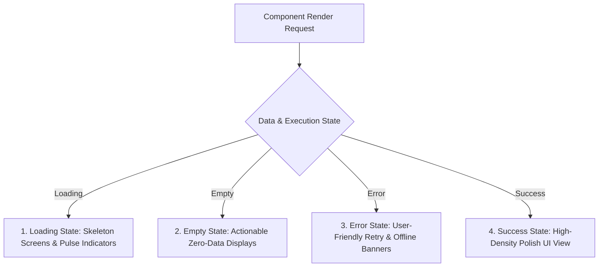

# Trinetra Restaurant OS — Frontend Architecture Specification

> [!IMPORTANT]
> **Document Status**: Draft for Review (Milestone 1 — Document 5 of 8)  
> **Source of Truth Alignment**: [AGENTS.md](file:///c:/Users/ASUS/OneDrive/Desktop/Trinetra%20digital/AGENTS.md) & [docs/SYSTEM_ARCHITECTURE.md](file:///c:/Users/ASUS/OneDrive/Desktop/Trinetra%20digital/docs/SYSTEM_ARCHITECTURE.md)  
> **Note**: This document specifies UI structure, component layout, state management, route hierarchy, and interaction design **without writing executable code**.

---

## 1. Application Structure & Module Layout

The frontend is built using **Next.js 15 (App Router)**, **React**, **TailwindCSS**, `shadcn/ui` primitives, and **Framer Motion**. The application code is structured logically inside `src/` to separate global UI primitives, domain components, state stores, and page views.

```
src/
├── app/                          # Next.js App Router (Routing & Server Components)
│   ├── (auth)/                   # Authentication route group (Login, PIN lock screen)
│   └── restaurant/               # Protected Restaurant OS Operational Portal
│       ├── layout.tsx            # Main OS Layout (Sidebar, Topbar, Quick PIN Switcher)
│       ├── pos/                  # Point of Sale (POS) Order Entry View
│       ├── kds/                  # Kitchen Display System (KDS) Feed
│       ├── floor/                # Floor Plan & Table Management View
│       ├── billing/              # Billing & Payment Cashier View
│       ├── inventory/            # Basic Inventory & Recipe BOM View
│       ├── settings/             # Restaurant & Branch Settings
│       └── reports/              # Daily Sales & Operations Dashboard
│
├── components/                   # Reusable UI & Feature Components
│   ├── ui/                       # Low-level primitives (Button, Modal, Input, Badge)
│   ├── pos/                      # POS-specific widgets (MenuGrid, CartSidebar, ModifierModal)
│   ├── kds/                      # KDS-specific widgets (TicketCard, StationFilter, AlertSound)
│   ├── floor/                    # Floor layout widgets (TableGrid, TableCard, ZonePicker)
│   ├── billing/                  # Billing widgets (BillSplitModal, ReceiptPreview, PayCollector)
│   ├── inventory/                # Inventory widgets (StockTable, RecipeViewer, WasteForm)
│   └── shared/                   # Cross-cutting UI (Header, StaffPinModal, NetworkBanner)
│
├── hooks/                        # Custom React Hooks (useRealtimeOrder, useKeyboardShortcuts)
├── stores/                       # Client State Stores (Zustand)
│   ├── useStaffAuthStore.ts      # Active staff PIN context & session state
│   ├── useCartStore.ts           # Active POS order cart state
│   ├── useFloorStore.ts          # Table selection & zone filter state
│   └── useKdsStore.ts            # KDS station filter & sound settings
│
├── services/                     # Frontend API Clients & Data Fetchers (React Query)
└── types/                        # Strict TypeScript Frontend Contracts & DTOs
```

---

## 2. Route Hierarchy & Navigation Flow

The Restaurant OS uses strict, role-protected routes under `/restaurant/*`.

```mermaid
graph TD
    Root[/] --> AdminAuth[/admin - Owner Email Login]
    AdminAuth --> PortalLayout[/restaurant Portal Layout]

    subgraph Protected Operational Routes
        PortalLayout --> POS[/restaurant/pos - Waiter/Cashier POS Order Entry]
        PortalLayout --> KDS[/restaurant/kds - Kitchen Staff Display Feed]
        PortalLayout --> Floor[/restaurant/floor - Table Management]
        PortalLayout --> Billing[/restaurant/billing - Cashier Payment Collector]
        PortalLayout --> Inventory[/restaurant/inventory - Stock & Recipe BOM]
        PortalLayout --> Settings[/restaurant/settings - Branch Settings]
        PortalLayout --> Reports[/restaurant/reports - Owner Daily Sales Dashboard]
    end

    subgraph Auth Guards
        POS & KDS & Floor & Billing --> CheckStaffPIN{Active Staff PIN Session?}
        CheckStaffPIN -->|Yes| RenderView[Render View]
        CheckStaffPIN -->|No| ShowPINModal[Display Quick PIN Lock Screen]
    end
```

---

## 3. State Management Strategy

To ensure zero-lag UI performance, state is strictly divided into **Server State**, **Client UI State**, and **Realtime Sync State**.

```mermaid
graph TD
    subgraph Server State (TanStack / React Query)
        S1[Active Menu & Modifiers]
        S2[Table Layout & Zones]
        S3[Open Customer Sessions]
        S4[Daily Sales Summaries]
    end

    subgraph Client UI State (Zustand Stores)
        C1[Active Staff PIN Session Claims]
        C2[Current POS Cart & Modifiers Draft]
        C3[Active KDS Station Filter]
        C4[Selected Table & Guest Count]
    end

    subgraph Realtime Sync Engine (Supabase CDC)
        R1[Postgres CDC Logical Replication]
    end

    R1 -->|Invalidate Query Cache| S1 & S2 & S3
    S1 --> UI[React UI Components]
    C2 --> UI
    C1 --> UI
```

### State Management Separation

| State Category | Technology | Usage & Scope | Key Performance Guarantee |
|----------------|------------|---------------|---------------------------|
| **Server State** | TanStack Query (React Query) | Asynchronous backend data (Menu items, table lists, reports). | Optimistic updates on order adds, automated cache invalidations. |
| **Client Cart State** | Zustand (`useCartStore`) | Active POS cart, item selections, modifiers, running totals. | In-memory instant UI updates (< 16ms) without network latency. |
| **Staff Auth State** | Zustand (`useStaffAuthStore`) | Staff PIN context, active user role, device lock state. | Fast < 3s staff context switching without page reloads. |
| **Realtime Sync State** | Supabase WebSockets | Broadcasted CDC events (`ORDER_PLACED`, `ITEM_86_TOGGLED`). | Realtime cache invalidations updating POS/KDS screens in < 300ms. |

---

## 4. Feature Module Architecture

### 4.1 Point of Sale (POS) View (`/restaurant/pos`)
- **Left Panel**: Menu category tabs + fast-filtered Menu Item Grid (with visual Veg/Non-Veg badges and 86'd disabled states).
- **Right Panel**: Active Order Cart Sidebar displaying item list, modifier details, free-text kitchen notes, subtotal, tax breakdown, and running total.
- **Header Toolbar**: Dine-in / Takeaway toggle, Selected Table Badge, Quick PIN Staff Switcher.
- **Action Bar**: Fixed bottom touch bar: `Send to Kitchen`, `Void Item`, `Apply Discount`, `Print Bill`.

### 4.2 Kitchen Display System (KDS) View (`/restaurant/kds`)
- **Top Bar**: Station Selector (`All Stations`, `Main Kitchen`, `Tandoor`, `Bar`), Audio Alert Toggle, Active Order Counter.
- **Grid Feed**: Responsive card grid of active kitchen tickets sorted by `created_at` (Oldest first).
- **Ticket Cards**: Displays table number, order type, elapsed timer (color-coded: Green < 10m, Yellow 10-20m, Red > 20m), line items with modifier badges and special notes.
- **Actions**: Single-tap `Mark Item Ready` or `Mark Ticket Complete`.

### 4.3 Floor & Table View (`/restaurant/floor`)
- **Zone Selector**: Tabs for `Main Hall`, `Garden`, `Private Dining`, `Counter`.
- **Table Grid**: High-density grid rendering table cards with status-based visual styling:
  - **Green (Available)**: Single-tap to open new session (prompts Guest Count).
  - **Red (Occupied)**: Displays elapsed time, current order count, running total. Single-tap to open POS order.
  - **Yellow (Bill Requested)**: Indicates customer asked for bill. Single-tap to open Billing view.
  - **Gray (Cleaning)**: Table being reset. Single-tap to return to Available.

### 4.4 Billing & Cashier View (`/restaurant/billing`)
- **Session Selector**: List of tables with requested bills or takeaway orders awaiting payment.
- **Bill Breakdown**: Itemized list, subtotal, CGST + SGST tax breakdown, service charge, net payable.
- **Discount Control**: Manager PIN-protected percentage/flat discount entry.
- **Split Bill Control**: Equal split (divide by N) or Custom Amount split.
- **Payment Method Selector**: Cash (calculates change due), Card, UPI (displays branch QR code).
- **Action**: Single-click `Complete Payment & Print Receipt`.

---

## 5. Interaction Design: Touch & Keyboard Optimization

Restaurant environments require extreme interaction speed. The UI is designed for dual input optimization:

### Touch Optimization (Tablets & Mobile)
- **Target Sizes**: All interactive touch targets are a minimum of **44px × 44px** (60px × 60px for primary POS action buttons).
- **No Double-Tap Delays**: Fast-tap handlers eliminate standard mobile browser click delays.
- **Direct Selection**: Single-tap item additions directly update the cart sidebar.

### Keyboard Shortcuts (Desktop / Fast POS Stations)

| Keyboard Shortcut | Action Executed |
|-------------------|-----------------|
| `F1` | Focus Menu Item Search Bar |
| `F2` | Send Current Order to Kitchen |
| `F3` | Open Payment & Billing View |
| `F4` | Quick Staff PIN Switcher |
| `Space` | Select First Available Menu Item |
| `Esc` | Close Active Modal / Cancel Operation |

---

## 6. UI Boundary Contract (The 4-State Rule)

Every major view and component in Trinetra Restaurant OS must implement **all four UI states**:



### State Specifications

1. **Loading State**: Uses high-fidelity Skeleton UI blocks matching exact page layout (no generic central spinners) to eliminate layout shifts.
2. **Empty State**: Displays clear, actionable context (e.g., "No active orders in kitchen queue", "All tables are currently available") with single-click creation triggers.
3. **Error State**: Captures API/Network failures cleanly, providing human-readable error messages and single-click `Retry` actions without breaking UI layouts.
4. **Success State**: Premium, high-density, dark-mode compatible operational view optimized for daylight visibility in busy environments.

---

## 7. Architectural Summary

This `FRONTEND_ARCHITECTURE.md` document establishes the client-side framework:
- Defines Next.js 15 App Router structure and protected operational routes under `/restaurant/*`.
- Establishes a clean state management split: React Query for Server State, Zustand for Client Cart/Auth State, and Supabase CDC WebSockets for Realtime sync.
- Outlines dedicated feature modules for POS, KDS, Floor Management, and Billing.
- Mandates dual-input accessibility: min 44px touch targets and full keyboard shortcut mapping.
- Enforces the strict 4-State UI contract (Loading, Empty, Error, Success) across all screens.

---

> [!NOTE]
> **Next Recommended Step**: Upon approval of this document, we will proceed to **Document 6 of 8: `SECURITY_MODEL.md`** to formalize authentication standards, session security, encryption, and system security boundaries without writing code.
