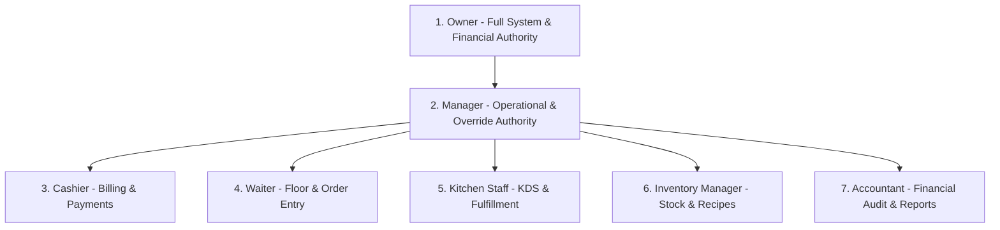
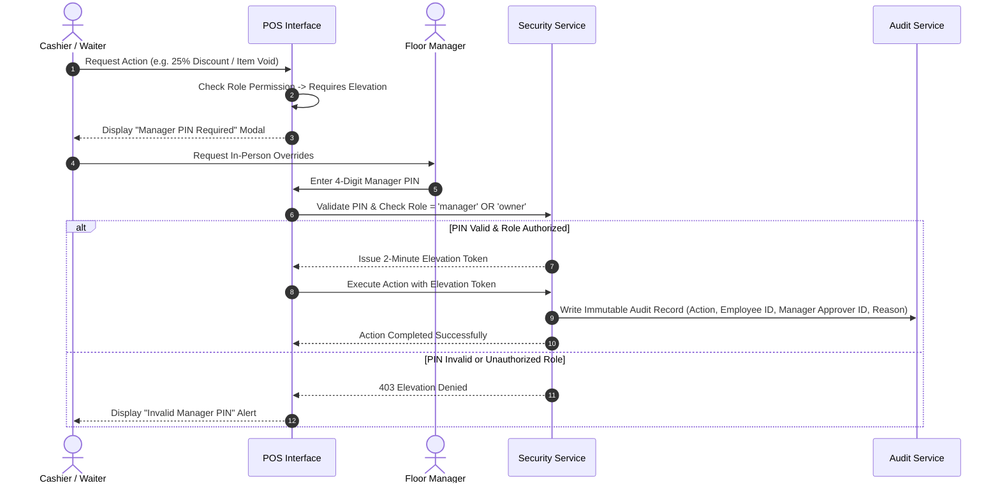

# Trinetra Restaurant OS — Role-Based Access Control (RBAC) Specification

> [!IMPORTANT]
> **Document Status**: Draft for Review (Milestone 1 — Document 7 of 8)  
> **Source of Truth Alignment**: [AGENTS.md](file:///c:/Users/ASUS/OneDrive/Desktop/Trinetra%20digital/AGENTS.md) & [docs/SECURITY_MODEL.md](file:///c:/Users/ASUS/OneDrive/Desktop/Trinetra%20digital/docs/SECURITY_MODEL.md)  
> **Note**: This document formalizes the 7 user roles, permission taxonomies, matrix policies, and manager elevation workflows **without executable code**.

---

## 1. Role Hierarchy & Primary Responsibilities

Trinetra Restaurant OS defines 7 discrete user roles, each aligned with real restaurant staff functions:

### Role Summary Table

| Role | Primary Persona | Key Functional Scope | Default PIN Access Level |
|------|-----------------|----------------------|--------------------------|
| **Owner** | Restaurant Proprietor | Full access across all branches, settings, reports, staff management, and financial audits. | Full Administrative + PIN |
| **Manager** | Shift Supervisor | Floor oversight, operational overrides (voids, comps, high discounts), staff shift control. | Full Operational + Manager PIN Elevation |
| **Cashier** | Billing Counter Operator | Bill settlement, payment recording (Cash/Card/UPI), receipt printing, basic discounts (< 20%). | Staff PIN (POS & Billing) |
| **Waiter** | Table Waiter | Table seating, guest count entry, order creation, item notes, sending orders to kitchen. | Staff PIN (POS & Floor) |
| **Kitchen Staff** | Head Chef / Line Cook | Viewing KDS order feed, marking items ready, toggling item 86'd (sold out) status. | Staff PIN (KDS Display) |
| **Inventory Manager** | Storekeeper / Stock Mgr | Recording stock-in, managing recipe BOMs, logging waste, checking low stock alerts. | Staff PIN (Inventory Portal) |
| **Accountant** | Financial Auditor | View-only access to financial reports, daily sales summaries, GST tax reports, audit logs. | Read-Only Credentials |

---

## 2. Granular Permission Matrix Across All 7 Roles

Permissions follow a structured domain taxonomy: `<domain>:<resource>:<action>` (e.g., `pos:orders:cancel`, `billing:discounts:approve`, `menu:items:toggle_86`).

### Access Level Definitions
- **FULL**: Direct execution permitted without restriction.
- **READ**: View/read access permitted; mutations forbidden.
- **ELEVATED**: Requires Manager or Owner PIN verification before execution.
- **NONE**: Action is strictly forbidden and hidden from the user interface.

### Comprehensive Permission Matrix

| Permission String | Domain / Feature | Owner | Manager | Cashier | Waiter | Kitchen | Inventory | Accountant |
|-------------------|------------------|:-----:|:-------:|:-------:|:------:|:-------:|:---------:|:----------:|
| **`settings:branch:manage`** | Restaurant & GST Settings | **FULL** | READ | NONE | NONE | NONE | NONE | READ |
| **`auth:staff:manage`** | Staff Accounts & PIN Reset | **FULL** | **FULL** | NONE | NONE | NONE | NONE | NONE |
| **`menu:items:manage`** | Create/Edit Menu Items | **FULL** | **FULL** | NONE | NONE | NONE | NONE | NONE |
| **`menu:items:toggle_86`** | Mark Item 86'd / Sold Out | **FULL** | **FULL** | NONE | NONE | **FULL** | NONE | NONE |
| **`floor:tables:manage`** | Floor Zones & Layout Setup | **FULL** | **FULL** | NONE | NONE | NONE | NONE | NONE |
| **`floor:tables:status`** | Update Table Status (Clean) | **FULL** | **FULL** | **FULL** | **FULL** | NONE | NONE | NONE |
| **`sessions:create`** | Open Table / Guest Count | **FULL** | **FULL** | **FULL** | **FULL** | NONE | NONE | NONE |
| **`pos:orders:create`** | Create & Send POS Order | **FULL** | **FULL** | **FULL** | **FULL** | NONE | NONE | NONE |
| **`pos:orders:modify_sent`**| Cancel/Modify Sent Item | **FULL** | **FULL** | ELEVATED | ELEVATED | NONE | NONE | NONE |
| **`pos:orders:void`** | Void Item (No Charge) | **FULL** | **FULL** | ELEVATED | ELEVATED | NONE | NONE | NONE |
| **`kitchen:kds:view`** | View KDS Ticket Feed | **FULL** | **FULL** | READ | READ | **FULL** | NONE | NONE |
| **`kitchen:kds:update`** | Mark Item / Ticket Ready | **FULL** | **FULL** | NONE | NONE | **FULL** | NONE | NONE |
| **`billing:discounts:basic`**| Apply Discount <= 20% | **FULL** | **FULL** | **FULL** | NONE | NONE | NONE | NONE |
| **`billing:discounts:high`** | Apply Discount > 20% | **FULL** | **FULL** | ELEVATED | NONE | NONE | NONE | NONE |
| **`billing:comp:approve`** | Mark Bill Complimentary | **FULL** | **FULL** | ELEVATED | NONE | NONE | NONE | NONE |
| **`billing:payments:settle`**| Record Payment & Invoice | **FULL** | **FULL** | **FULL** | NONE | NONE | NONE | NONE |
| **`billing:invoices:void`** | Void Closed Invoice / Refund | **FULL** | **FULL** | ELEVATED | NONE | NONE | NONE | NONE |
| **`inventory:stock:entry`**| Record Stock In Delivery | **FULL** | **FULL** | NONE | NONE | NONE | **FULL** | NONE |
| **`inventory:waste:log`** | Log Ingredient/Food Waste | **FULL** | **FULL** | NONE | NONE | **FULL** | **FULL** | NONE |
| **`inventory:bom:manage`** | Recipe BOM Management | **FULL** | **FULL** | NONE | NONE | NONE | **FULL** | NONE |
| **`reports:sales:view`** | Daily Sales & Tax Reports | **FULL** | **FULL** | READ | NONE | NONE | NONE | **FULL** |
| **`audit:logs:view`** | Financial & Security Logs | **FULL** | **FULL** | NONE | NONE | NONE | NONE | **FULL** |

---

## 3. Allowed & Restricted Actions by Role

### 3.1 Owner
- **Allowed Actions**: Complete authority over restaurant settings, GSTIN/FSSAI info, staff onboarding, menu design, pricing, financial reporting, and audit logs.
- **Restricted Actions**: None.
- **Approval Responsibilities**: Final escalation point for business policy overrides.

### 3.2 Manager
- **Allowed Actions**: Full control over daily floor operations, staff PIN resets, KDS feeds, inventory stock entries, and standard sales reporting.
- **Restricted Actions**: Modifying organization legal entity details or deleting the branch.
- **Approval Responsibilities**: Authorizes high discounts (> 20%), item voids after kitchen send, complimentary bills, invoice refunds, and manual inventory adjustments.

### 3.3 Cashier
- **Allowed Actions**: Access Billing view, apply basic discounts (<= 20%), select payment methods (Cash/Card/UPI), trigger split bills, print tax receipts, and view daily register totals.
- **Restricted Actions**: Cannot modify menu pricing, view financial audit logs, or edit recipe BOMs.
- **Required Approvals**: Requires Manager PIN for high discounts (> 20%), bill comps, and voiding closed invoices.

### 3.4 Waiter
- **Allowed Actions**: View floor plan, assign tables, enter guest count, create dine-in and takeaway orders, attach modifiers and item special notes, send orders to kitchen, and request bills.
- **Restricted Actions**: Cannot settle payments, view sales reports, access inventory, or toggle item pricing.
- **Required Approvals**: Requires Manager PIN to void an item or cancel an order after it has been sent to the kitchen.

### 3.5 Kitchen Staff
- **Allowed Actions**: Access KDS screen, filter tickets by kitchen station, mark items/tickets as `preparing` or `ready`, trigger kitchen ticket printing, and toggle menu items as `86'd (Unavailable)`.
- **Restricted Actions**: Cannot view financial amounts, prices, billing totals, or modify customer sessions.

### 3.6 Inventory Manager
- **Allowed Actions**: View inventory dashboard, record stock deliveries (`Stock In`), manage Recipe BOMs, log ingredient waste, and check low stock threshold alerts.
- **Restricted Actions**: Cannot take customer orders, process payments, or alter tax settings.

### 3.7 Accountant
- **Allowed Actions**: Read-only access to daily sales summaries, category sales breakdowns, tax collection summaries (CGST/SGST), payment method breakdowns, and audit logs.
- **Restricted Actions**: Cannot execute any operational mutations (cannot take orders, open tables, or process payments).

---

## 4. Manager Elevation Workflows

When an employee attempts an action marked `ELEVATED`, the system executes a mandatory **Approval Escalation Workflow**.

### Mandatory Elevation Scenarios

1. **High Discount Escalation**:
   - Trigger: Bill discount percentage > 20% OR flat discount > ₹500.
   - Requirement: Manager PIN + Reason selection (`Regular Customer`, `Service Delay`, `Owner Approval`).

2. **Sent Item Void Escalation**:
   - Trigger: Voiding or cancelling an order item after status = `accepted` or `preparing`.
   - Requirement: Manager PIN + Waste Category selection (`Kitchen Waste`, `Customer Rejection`, `Staff Error`).

3. **Complimentary Bill Escalation**:
   - Trigger: Setting Net Payable Amount to ₹0.00 (`Comp`).
   - Requirement: Manager PIN + Immutable audit entry.

4. **Invoice Refund Escalation**:
   - Trigger: Reversing a payment or voiding a closed invoice.
   - Requirement: Manager PIN + Original Payment Reference verification.

---

## 5. Architectural Summary

This `RBAC_MODEL.md` document completes the permission specification:
- Formally defines the 7 user roles and their operational scopes.
- Establishes a granular permission string taxonomy (`domain:resource:action`).
- Documents a comprehensive permission matrix across all 10 system domains.
- Lists explicit allowed, restricted, and elevated actions for every role.
- Formalizes step-by-step Manager Approval Workflows with mandatory audit logging.

---

> [!NOTE]
> **Next Recommended Step**: Upon approval of this document, we will proceed to **Document 8 of 8: `REALTIME_MODEL.md`** to detail WebSocket channels, publisher/subscriber event flows, payload schemas, and failure reconnection strategies without writing code.
