# Trinetra Restaurant OS — Distributed Realtime Model Specification

> [!IMPORTANT]
> **Document Status**: Draft for Review (Milestone 1 — Document 8 of 8)  
> **Source of Truth Alignment**: [AGENTS.md](file:///c:/Users/ASUS/OneDrive/Desktop/Trinetra%20digital/AGENTS.md) & [docs/SYSTEM_ARCHITECTURE.md](file:///c:/Users/ASUS/OneDrive/Desktop/Trinetra%20digital/docs/SYSTEM_ARCHITECTURE.md)  
> **Note**: This document formalizes the realtime distributed event architecture, WebSocket channel strategies, event flows, security boundaries, and failure recovery protocols **without executable code, SQL, or client script implementations**.

---

## 1. Realtime Architectural Philosophy

In a high-volume restaurant, real-time data synchronization bridges the gap between customer-facing staff (Waiters, Cashiers) and production staff (Chefs, Line Cooks, Bartenders).

### 1.1 Why Realtime Exists in Restaurant OS
- **Operational Speed**: Eliminates manual page refreshes and physical shouting between floor and kitchen.
- **Order Accuracy**: Instantly communicates order additions, special notes, and item cancellations to the kitchen.
- **Inventory Leakage Prevention**: Instantly disables (86s) sold-out items across all POS tablets the moment the kitchen marks them unavailable.
- **Floor Visibility**: Provides immediate visual table status feedback (`Available` → `Occupied` → `BillRequested` → `Cleaning`) to hosts and waiters.

### 1.2 Where Realtime SHOULD Be Used (Event-Driven Touchpoints)
- Kitchen Display System (KDS) order feed updates.
- Floor plan table status state changes.
- Item 86'd (sold out / unavailable) availability toggles.
- Realtime order cancellations and item void alerts.
- Live bill payment and table release notifications.

### 1.3 Where Realtime Should NOT Be Used (Request-Response Touchpoints)
- **Financial Auditing & Invoicing**: Bill generation and payment settlements use strict, synchronous REST API calls with ACID transaction guarantees. Realtime is used only to broadcast the *result* of a closed bill.
- **Historical Reporting**: Analytics, sales reports, and stock reports use standard on-demand HTTP API queries.
- **Staff Authentication**: PIN verification executes synchronously via HTTPS to ensure tight security token validation.

---

## 2. Event Architecture & Taxonomy

Realtime events are structured, versioned, immutable messages emitted by backend services upon committing database state changes.

### 2.1 Event Naming Convention
All events follow a hierarchical 3-part dot-notation string:  
`<domain>.<resource>.<action>`

Examples:
- `pos.order.created`
- `pos.order.cancelled`
- `kitchen.ticket.status_changed`
- `floor.table.status_changed`
- `menu.item.availability_changed`

### 2.2 Domain Event Taxonomy

| Event Name | Domain | Trigger Source | Primary Intent |
|------------|--------|----------------|----------------|
| **`pos.order.created`** | POS | Waiter submits new order | Notify Kitchen KDS & Floor POS |
| **`pos.order.modified`** | POS | Waiter adds items / notes | Update KDS ticket & POS Cart |
| **`pos.order.cancelled`** | POS | Manager cancels order/item | Alert Kitchen to stop prep |
| **`kitchen.ticket.status_changed`** | Kitchen | Chef updates prep status | Notify Waiter (Order Ready) |
| **`floor.table.status_changed`** | Floor | Session opened / bill asked | Update visual floor grid |
| **`billing.invoice.generated`** | Billing | Bill requested / printed | Update table status to BillRequested |
| **`billing.payment.completed`** | Billing | Payment recorded | Close session & release table |
| **`inventory.stock.alert`** | Inventory | Stock drops below threshold | Alert Inventory Manager & Chef |
| **`menu.item.availability_changed`**| Menu | Kitchen marks item 86'd | Instantly disable item on POS |
| **`auth.terminal.locked`** | Security | Staff PIN switch / Timeout | Lock shared POS screen context |
| **`security.approval.granted`** | Security | Manager PIN elevation | Proceed with elevated void/comp |

---

## 3. Channel Strategy & Isolation Boundaries

Realtime communication is partitioned using **Strict Topic Scoping** to guarantee tenant and branch data isolation.

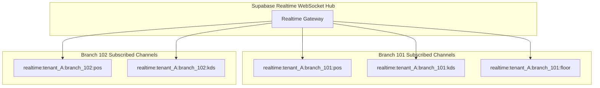

### 3.1 Channel Naming Pattern
Channel topics follow a strict secure string template:  
`realtime:<tenant_id>:<branch_id>:<channel_type>`

#### Supported Channel Types
- **`pos`**: Broadcasts order updates, voids, and bill requests across floor POS devices.
- **`kds`**: Broadcasts active kitchen tickets, item ready alerts, and 86'd availability signals.
- **`floor`**: Broadcasts seating status changes, guest count updates, and table cleanup notifications.
- **`admin`**: Broadcasts inventory alerts, low stock warnings, and security elevation events.

---

## 4. Publisher Matrix

Identifies the server-side modules responsible for emitting realtime events.

| Server Module | Event Emitted | Trigger Condition | Broadcast Payload Content |
|---------------|---------------|-------------------|---------------------------|
| **`OrderService`** | `pos.order.created` | New order transaction committed | Order ID, Table ID, Items, Modifiers, Notes, Waiter ID |
| **`OrderService`** | `pos.order.cancelled` | Manager voids item/order | Order ID, Cancelled Item ID, Waste Reason, Approver ID |
| **`KitchenService`** | `kitchen.ticket.status_changed` | Chef taps `Preparing` or `Ready` | Ticket ID, Table ID, Status (`ready`), Station ID |
| **`FloorService`** | `floor.table.status_changed` | Table seated, bill asked, or reset | Table ID, New Status, Guest Count, Active Session ID |
| **`BillingService`** | `billing.payment.completed` | Full payment received & logged | Invoice ID, Table ID, Amount Paid, Session Closed Flag |
| **`MenuService`** | `menu.item.availability_changed` | Kitchen toggles item 86'd | Item ID, Item Name, Available Flag (`false`) |
| **`InventoryService`** | `inventory.stock.alert` | Item stock <= threshold | Ingredient ID, Name, Current Stock, Threshold |

---

## 5. Subscriber Matrix

Identifies client-side roles and screens that consume realtime events.

| Client View / Role | Subscribed Channels | Target Events Received | UI Action / Reaction Triggered |
|--------------------|---------------------|------------------------|--------------------------------|
| **Kitchen KDS Screen** | `kds` | `pos.order.created`<br>`pos.order.cancelled`<br>`menu.item.availability_changed` | Adds new ticket card + Audio chime.<br>Strikethrough cancelled items.<br>Highlights 86'd item status. |
| **Waiter Tablet POS** | `pos`, `kds`, `floor` | `kitchen.ticket.status_changed`<br>`menu.item.availability_changed`<br>`floor.table.status_changed` | Displays "Order Ready" badge on table.<br>Disables 86'd item in menu grid.<br>Updates table color indicator. |
| **Cashier Billing POS**| `pos`, `floor` | `floor.table.status_changed`<br>`billing.invoice.generated` | Moves table to "Bill Requested" queue.<br>Loads calculated tax invoice preview. |
| **Floor Host View** | `floor` | `floor.table.status_changed` | Realtime visual update of table grid states. |
| **Inventory Portal** | `admin` | `inventory.stock.alert` | Displays red low-stock warning banner. |

---

## 6. Event Payload Standards & Security Rules

All realtime event payloads MUST strictly conform to standardized design rules:

### 6.1 Envelope Structure
```json
{
  "eventId": "evt_987f6543-e89b-12d3-a456-426614174000",
  "eventType": "pos.order.created",
  "version": "v1",
  "tenantId": "11111111-1111-1111-1111-111111111111",
  "branchId": "22222222-2222-2222-2222-222222222222",
  "timestamp": "2026-08-04T10:53:00.000Z",
  "sequenceNumber": 10452,
  "data": { ... }
}
```

### 6.2 Security & Size Guidelines
1. **Zero Sensitive Credentials**: Event payloads MUST NEVER contain password hashes, staff PINs, JWT tokens, or credit card numbers.
2. **Maximum Payload Size**: Payloads MUST NOT exceed **2 KB**. Large objects (e.g., historical sales summaries) send only an ID, prompting clients to fetch full details via REST API if needed.
3. **Sequence Ordering**: `sequenceNumber` increases monotonically per branch, allowing client receivers to detect missing or out-of-order messages.

---

## 7. Realtime Workflows (11 Event Flow Sequence Diagrams)

### 7.1 New Order Workflow
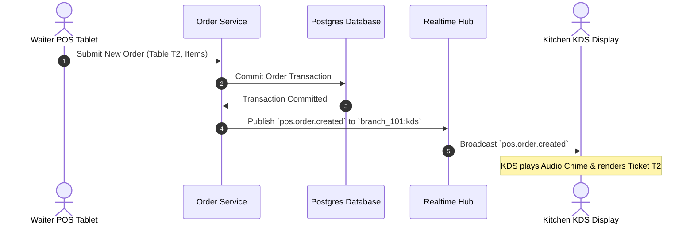

### 7.2 Order Modification Workflow
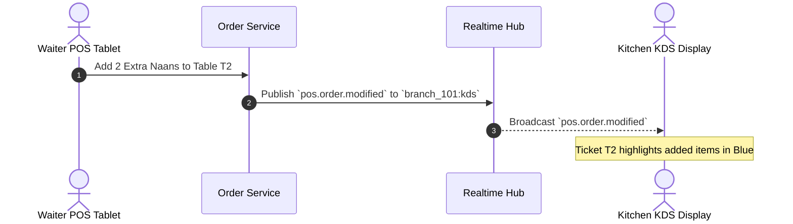

### 7.3 Order Cancellation Workflow
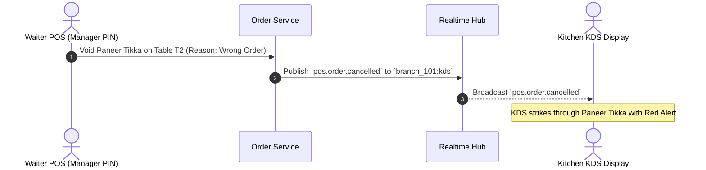

### 7.4 Kitchen Status Update Workflow
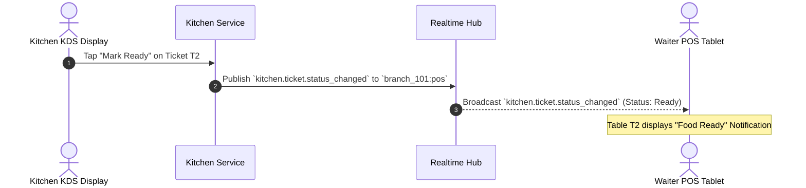

### 7.5 Table Status Update Workflow
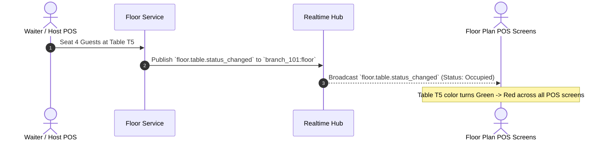

### 7.6 Bill Settlement Workflow
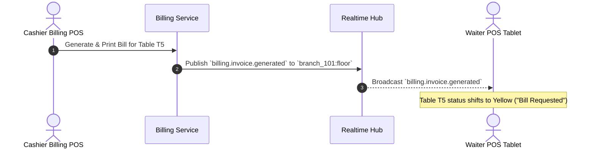

### 7.7 Inventory Deduction Workflow
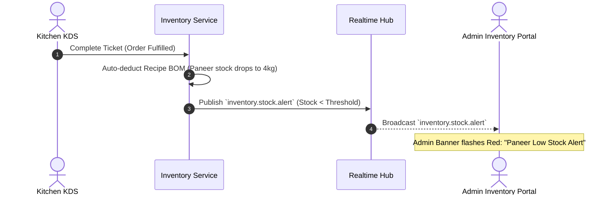

### 7.8 Menu Item 86'd (Sold Out) Workflow
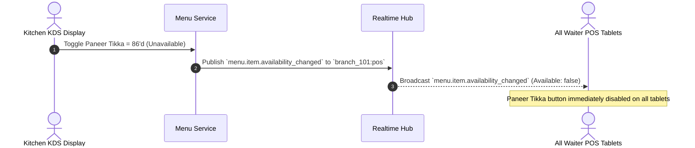

### 7.9 Staff PIN Login Workflow
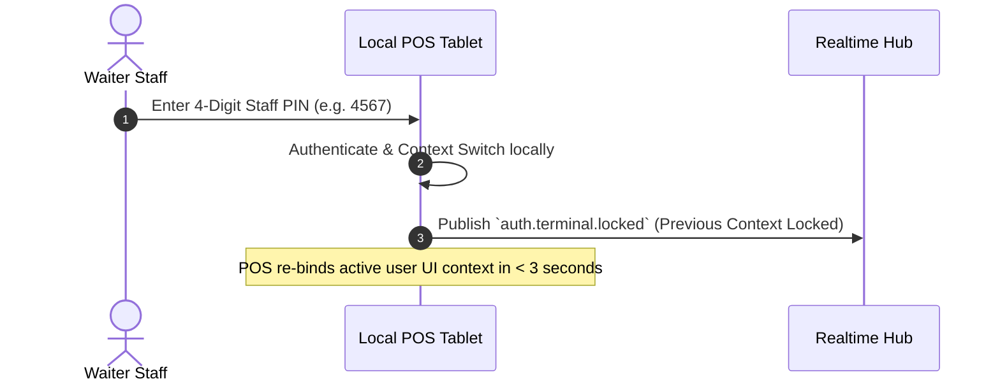

### 7.10 Manager Approval Workflow
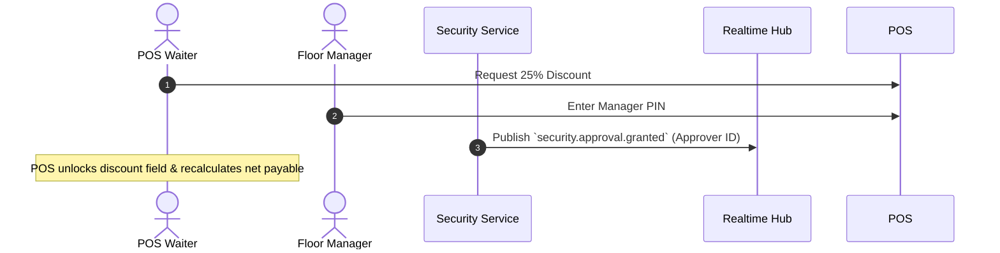

### 7.11 Payment Completion Workflow
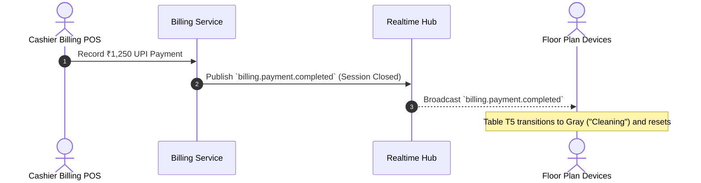

---

## 8. Failure Handling & Recovery Protocols

Distributed WebSocket connections are subject to network drops, latency spikes, and out-of-order deliveries.

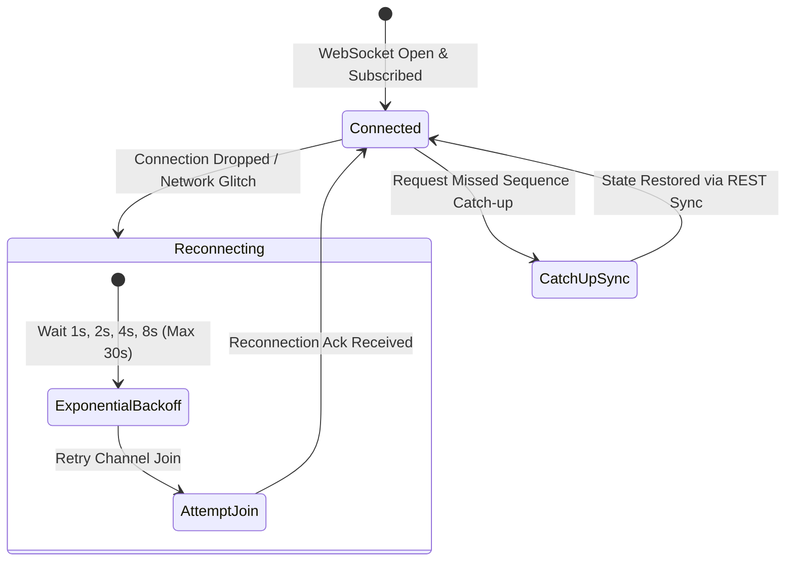

### Failure Recovery Specifications

| Failure Scenario | Detection Mechanism | Recovery Protocol |
|------------------|---------------------|-------------------|
| **Connection Drop** | Heartbeat ping failure (> 10s without pong). | Exponential backoff reconnect (1s → 2s → 4s → 8s → max 30s). Display subtle top-bar offline badge. |
| **Missed Sequence Gap** | Client receives `sequenceNumber = 104` after `101`. | Client identifies gap (missing 102, 103) and requests a REST catch-up query `/api/v1/sync?since=101`. |
| **Out-of-Order Events** | Payload `sequenceNumber` < last processed sequence. | Client discards stale event automatically. |
| **Duplicate Event** | Client receives `eventId` already present in local dedup cache. | Duplicate payload ignored safely (idempotent UI update). |
| **Slow Connection (> 2s)**| Round-trip latency check > 2000ms. | Fallback from aggressive realtime animations to periodic HTTP polling (15s interval). |

---

## 9. Performance & Latency Targets

Realtime performance is measured from **database transaction commit** to **client UI rendering**.

```mermaid
gantt
    title Measurable Realtime Latency Budget
    dateFormat X
    axisFormat %s ms

    section KDS Order Feed (< 300ms)
    DB Commit & CDC Extraction :active, 0, 50
    Supabase Realtime Broadcast :active, 50, 150
    Client Rendering & Chime   :active, 150, 280

    section Table Status Update (< 200ms)
    DB Commit & CDC Extraction :active, 0, 40
    Supabase Realtime Broadcast :active, 40, 120
    Floor Grid Color Update    :active, 120, 180
```

### SLA Latency Targets

| Operational Metric | Target Latency (95th Percentile) | Maximum Acceptable Latency |
|--------------------|----------------------------------|----------------------------|
| **KDS Order Ticket Delivery** | **< 300 ms** | 1,000 ms |
| **Table Status State Change** | **< 200 ms** | 500 ms |
| **Item 86'd Sold Out Toggle** | **< 200 ms** | 500 ms |
| **Bill Payment & Table Release**| **< 200 ms** | 500 ms |

---

## 10. Realtime Security & Authorization

1. **Token Auth Check**: WebSockets require a valid JWT token during the initial connection handshake.
2. **Strict Topic Authorization**: Supabase RLS policies extend to Realtime channels. A staff member at Branch A cannot join `realtime:tenant_B:branch_B:kds`.
3. **Sanitized Broadcast Data**: Payload contains operational IDs and titles only; internal database connection strings or authorization secrets are strictly excluded.

---

## 11. Future Architectural Extension Points

The realtime model supports future engineering milestones without requiring core redesign:

- **Delivery Aggregators (Future)**: Inbound webhooks from Zomato/Swiggy publish to `pos.order.created` with `OrderType = Delivery`.
- **CRM Integration (Future)**: Customer visit alerts publish to `floor.customer.arrived` displaying guest preferences on POS screens.
- **AI Features (Future)**: AI prep time estimation engine listens to `kitchen.ticket.status_changed` to refine kitchen efficiency models.
- **Multi-Branch Dashboard (Future)**: Owner dashboard subscribes to `realtime:tenant_id:*:admin` to aggregate multi-location live metrics.

---

## 12. Document Summary & Milestone 1 Completion Declaration

This `REALTIME_MODEL.md` document completes the final architectural specification for Milestone 1:
- Defines clear boundaries for where realtime should and should not be used.
- Establishes a 3-part event naming taxonomy and strict `realtime:tenant_id:branch_id:channel` topic scoping.
- Maps complete Publisher and Subscriber matrices across all operational roles.
- Models 11 end-to-end event sequence diagrams matching real restaurant workflows.
- Outlines failure recovery, exponential backoffs, sequence catch-ups, and sub-300ms latency SLAs.

---

> [!IMPORTANT]
> **MILESTONE 1 ARCHITECTURE IS 100% COMPLETE AND SPECIFIED.**  
> All 8 architectural documents are written, verified, and saved in `docs/`:
> 1. [`SYSTEM_ARCHITECTURE.md`](file:///c:/Users/ASUS/OneDrive/Desktop/Trinetra%20digital/docs/SYSTEM_ARCHITECTURE.md)
> 2. [`DOMAIN_MODEL.md`](file:///c:/Users/ASUS/OneDrive/Desktop/Trinetra%20digital/docs/DOMAIN_MODEL.md)
> 3. [`DATABASE_STRATEGY.md`](file:///c:/Users/ASUS/OneDrive/Desktop/Trinetra%20digital/docs/DATABASE_STRATEGY.md)
> 4. [`BACKEND_ARCHITECTURE.md`](file:///c:/Users/ASUS/OneDrive/Desktop/Trinetra%20digital/docs/BACKEND_ARCHITECTURE.md)
> 5. [`FRONTEND_ARCHITECTURE.md`](file:///c:/Users/ASUS/OneDrive/Desktop/Trinetra%20digital/docs/FRONTEND_ARCHITECTURE.md)
> 6. [`SECURITY_MODEL.md`](file:///c:/Users/ASUS/OneDrive/Desktop/Trinetra%20digital/docs/SECURITY_MODEL.md)
> 7. [`RBAC_MODEL.md`](file:///c:/Users/ASUS/OneDrive/Desktop/Trinetra%20digital/docs/RBAC_MODEL.md)
> 8. [`REALTIME_MODEL.md`](file:///c:/Users/ASUS/OneDrive/Desktop/Trinetra%20digital/docs/REALTIME_MODEL.md)
