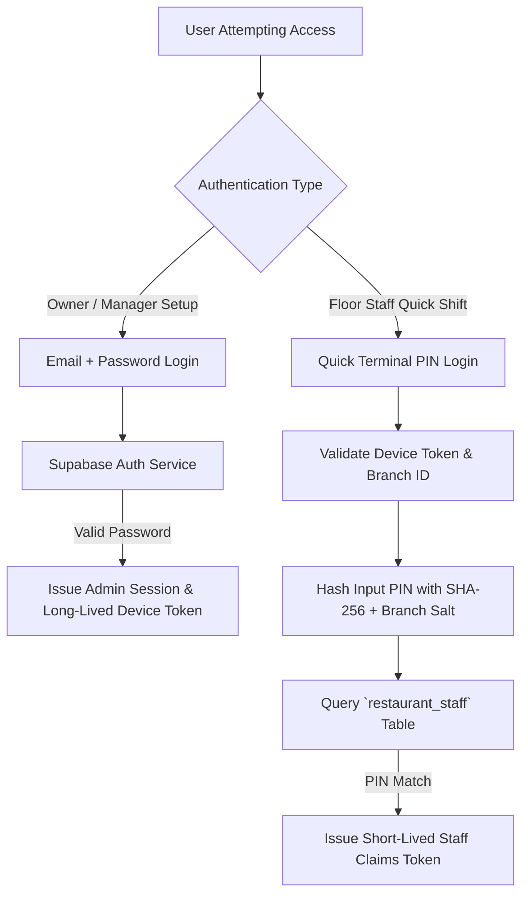
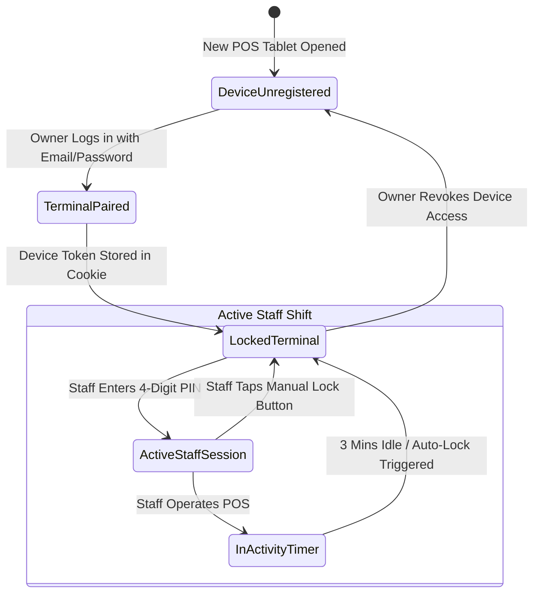
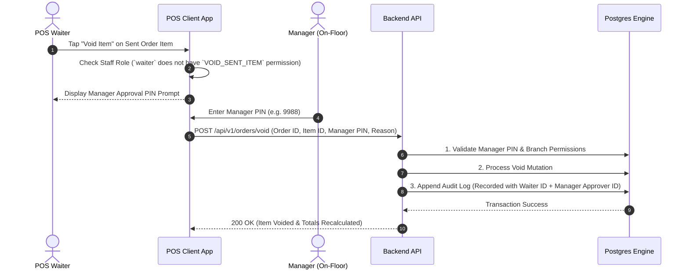

# Trinetra Restaurant OS — Security Model Specification

> [!IMPORTANT]
> **Document Status**: Draft for Review (Milestone 1 — Document 6 of 8)  
> **Source of Truth Alignment**: [AGENTS.md](file:///c:/Users/ASUS/OneDrive/Desktop/Trinetra%20digital/AGENTS.md) & [docs/SYSTEM_ARCHITECTURE.md](file:///c:/Users/ASUS/OneDrive/Desktop/Trinetra%20digital/docs/SYSTEM_ARCHITECTURE.md)  
> **Note**: This document specifies authentication mechanisms, session token lifecycles, permission elevation models, and security boundary protections **without writing executable code**.

---

## 1. Security Architecture & Threat Model

Trinetra Restaurant OS handles critical business data, financial transactions, and ingredient inventories. The security model enforces **Defense-in-Depth**, ensuring that security is validated across three distinct architectural layers:
1. **Edge Gateway Layer**: HTTPS enforcement, IP rate limiting, and Next.js Edge Middleware route guards.
2. **Application Server Layer**: Zod input sanitization, JWT session claim verification, and Manager PIN elevation logic.
3. **Database Layer**: PostgreSQL Row Level Security (RLS) policies enforcing multi-tenant and multi-branch data isolation at the database engine level.

```mermaid
graph TD
    subgraph Client Layer (Untrusted Device)
        A[Shared POS Tablet / Waiter Phone]
    end

    subgraph Layer 1: Edge & Network Guard
        B[HTTPS TLS 1.3 Termination]
        C[Rate Limiter & CSRF Guard]
        D[Next.js Edge Middleware]
    end

    subgraph Layer 2: Application Security Guard
        E[JWT Claim & PIN Validation]
        F[Zod Input Sanitization]
        G[Manager Elevation Check]
    end

    subgraph Layer 3: Database Engine Security Guard
        H[(PostgreSQL Engine)]
        I[Row Level Security - RLS]
        J[Immutable Audit Logger]
    end

    A -->|1. Incoming Payload| B
    B --> C
    C --> D
    D -->|2. Valid Session| E
    E --> F
    F --> G
    G -->|3. Query with Claims| H
    H --> I
    I -->|4. Commit & Audit| J
```

---

## 2. Authentication Architecture

The application supports a **Dual Authentication Strategy** designed for enterprise security and restaurant operational speed:



### Authentication Modes

| Auth Mode | Targeted User | Credentials | Token Type Issued | Primary Purpose |
|-----------|---------------|-------------|-------------------|-----------------|
| **Administrative Login** | Restaurant Owner, Manager | Email + Password | Full Supabase Auth JWT + HttpOnly Cookie | System configuration, initial terminal setup, reports, manager overrides. |
| **Quick Staff PIN Login** | Waiter, Cashier, Kitchen Staff | 4 to 6-Digit PIN | Short-lived Staff Claims JWT (In-Memory) | Rapid POS order entry, table seating, KDS status toggles on shared tablets. |

### Device Registration & Trust Model
- A POS tablet must be initially paired with a restaurant branch by an Owner/Manager using Administrative Login.
- Upon successful pairing, an encrypted `device_token` is stored in a `SameSite=Strict`, `HttpOnly` cookie.
- Quick PIN logins are **only accepted** from registered devices presenting a valid `device_token` for that specific branch.

---

## 3. Session Model & Token Lifecycle

Shared floor terminals present unique session hijacking risks. The session model balances fast context switching with strict auto-lock policies.



### Token Lifecycle & Expiry Rules

| Token / Cookie | Lifespan | Storage Location | Security Controls |
|----------------|----------|------------------|-------------------|
| **Device Cookie** | 30 Days | `HttpOnly`, `Secure`, `SameSite=Strict` Cookie | Cryptographically signed, bound to `tenant_id` and `branch_id`. |
| **Staff Claims JWT** | 15 Minutes (Auto-refreshed on activity) | In-Memory (Zustand Store) | Contains `user_id`, `branch_id`, `role`, `permissions_hash`. Never written to `localStorage`. |
| **Manager Elevation Token** | 2 Minutes | In-Memory (Transient State) | Issued upon valid Manager PIN entry for a specific high-risk action (e.g., Void/Discount). |

---

## 4. Permission Model & Elevation Workflows

The system implements a **Role-Based Access Control (RBAC)** architecture enhanced with **Action-Specific Permission Elevation**.

### High-Risk Operations requiring Manager Approval
Certain actions threaten revenue or inventory accuracy and CANNOT be performed by standard Waiters or Cashiers:
- Applying a bill discount exceeding configured threshold (e.g., > 20%).
- Voiding an item after it has been sent to the kitchen.
- Marking a bill as Complimentary ("Comp").
- Voiding a closed invoice or processing a refund.
- Manually adjusting ingredient inventory quantities.



---

## 5. Tenant & Branch Security Boundaries

Data isolation is guaranteed across three independent security boundaries:

### Boundary 1: Middleware Route Guard (Next.js Edge)
- Intercepts requests under `/restaurant/*` and `/api/v1/*`.
- Validates presence of valid Auth JWT and Device Token.
- Blocks cross-branch path traversal (e.g., a waiter at Branch 1 attempting to query `/api/v1/branches/branch_999/...`).

### Boundary 2: Zod & Controller Isolation
- API controllers extract `tenant_id` and `branch_id` strictly from verified JWT session claims — **never** from raw user-supplied body parameters.

### Boundary 3: PostgreSQL Row Level Security (RLS)
- Ultimate failsafe. Every table query executes within a database session populated with session claims (`app.current_tenant_id`, `app.current_branch_id`).
- PostgreSQL rejects rows belonging to other tenants/branches directly at the query execution plan level.

---

## 6. Threat Mitigation Matrix

| Threat / Vector | Risk | Architectural Mitigation Strategy |
|-----------------|------|-----------------------------------|
| **Cross-Tenant Data Leakage** | Critical | Compulsory `tenant_id` & `branch_id` on all tables enforced by database RLS policies. |
| **Shared Tablet Hijacking** | High | In-memory staff JWTs, 3-minute idle auto-lock screen, fast PIN context switching. |
| **PIN Brute-Force Attacks** | High | Rate limiting on PIN verification (Max 5 failed attempts per device per 15 minutes, then terminal lock). |
| **Unauthorized Discounts / Voids** | High | RBAC permission checks + mandatory Manager PIN elevation modal with audit log capture. |
| **Session Cookie Theft / XSS** | Medium | Auth cookies marked `HttpOnly`, `Secure`, `SameSite=Strict`. Input sanitized via Zod. |
| **Double Payment / Duplicate Order** | Medium | Compulsory `X-Idempotency-Key` headers on all POST/PUT order and payment routes. |
| **Audit Log Tampering** | High | Database RLS policy revokes `UPDATE` and `DELETE` access on `audit_logs` for all application roles. |

---

## 7. Architectural Summary

This `SECURITY_MODEL.md` document specifies the complete security framework:
- Implements a 3-layer Defense-in-Depth model (Edge Middleware → Application Zod/JWT → Postgres RLS).
- Formalizes Dual-Mode Authentication (Email/Password for Admin + Fast 4-digit PINs for floor staff).
- Defines a secure Token Lifecycle with short-lived in-memory claims and auto-locking shared terminal POS screens.
- Establishes a Manager Permission Elevation workflow for voids, comps, and high discounts.
- Outlines comprehensive mitigations for cross-tenant leaks, PIN brute-forcing, XSS/CSRF, and audit tampering.

---

> [!NOTE]
> **Next Recommended Step**: Upon approval of this document, we will proceed to **Document 7 of 8: `RBAC_MODEL.md`** to outline the complete permission matrix, allowed actions, restricted actions, and approval rules for all 7 user roles without writing code.
