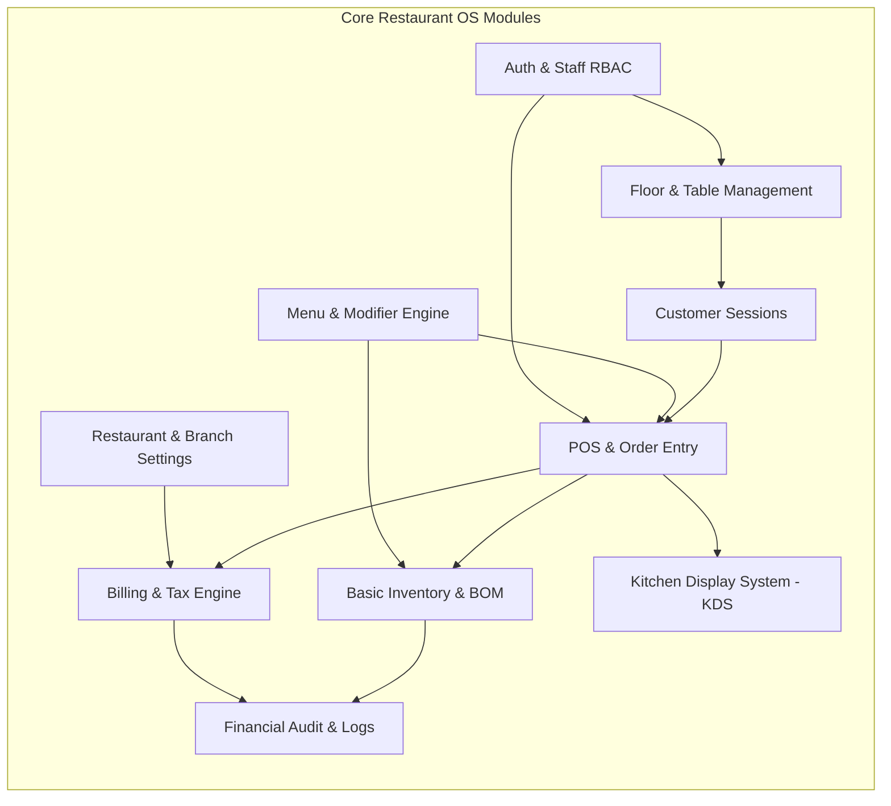
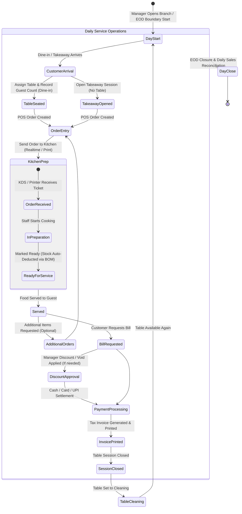
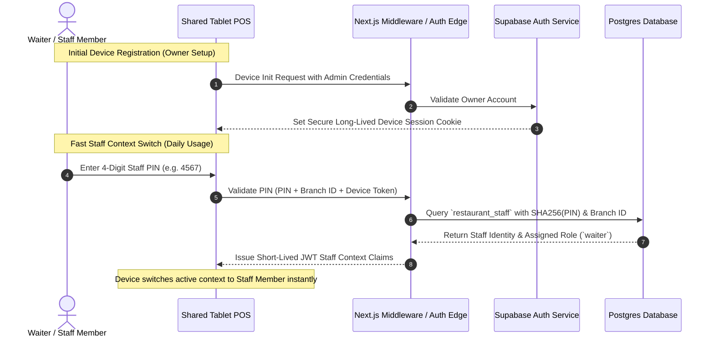
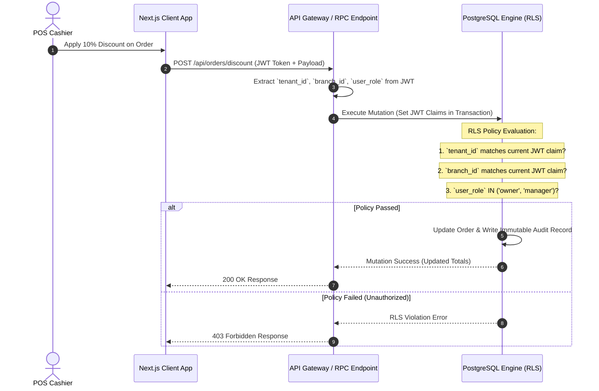
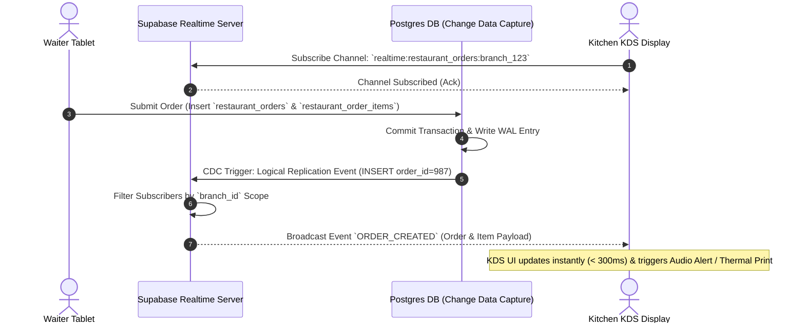
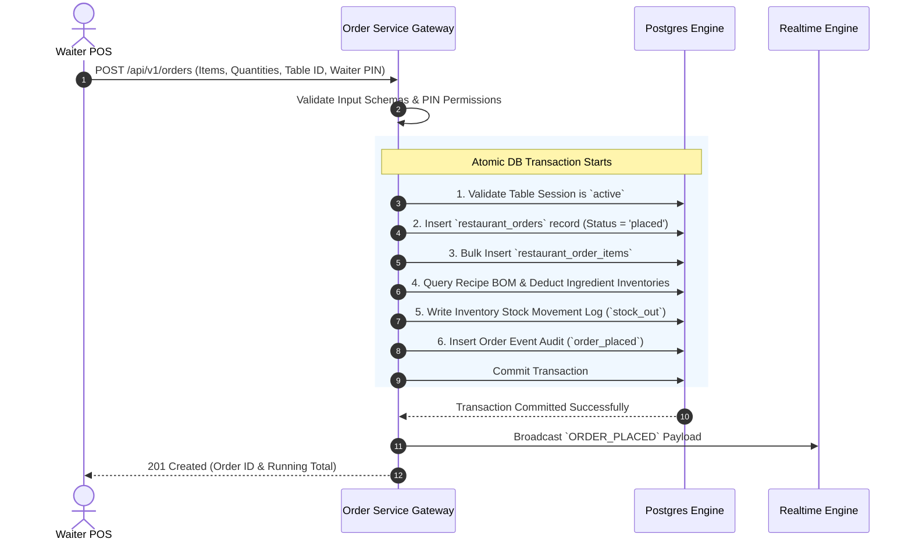

# Trinetra Restaurant OS — System Architecture Specification

> [!IMPORTANT]
> **Document Status**: Draft for Review (Milestone 1 — Document 1 of 8)  
> **Source of Truth Alignment**: [AGENTS.md](file:///c:/Users/ASUS/OneDrive/Desktop/Trinetra%20digital/AGENTS.md) & [docs/DEVELOPMENT_BACKLOG.md](file:///c:/Users/ASUS/OneDrive/Desktop/Trinetra%20digital/docs/DEVELOPMENT_BACKLOG.md)

---

## 1. Architectural Philosophy & High-Level Overview

Trinetra Restaurant OS is a standalone, commercial, multi-tenant SaaS platform built to handle real-world, high-concurrency restaurant operations. It operates independently from provisioning systems (such as the Trinetra CRM Super Admin Portal) and focuses strictly on high-speed, reliable operational execution.

### Key Architectural Pillars
1. **Tenant & Branch Hierarchy**: Every single record is strictly tied to a `tenant_id` (Organization/Restaurant Entity) and a `branch_id` (Physical Location).
2. **Deterministic Data Integrity**: Financial operations (bills, taxes, discounts, payments) and inventory transactions (stock deductions, recipe BOM consumption, waste) rely on ACID-compliant database operations and immutable audit event streams.
3. **High-Speed Operational Touchpoints**: Floor POS and Kitchen Display Systems (KDS) prioritize minimum click counts, touch/keyboard efficiency, and low-latency realtime synchronization (< 3 seconds).
4. **Resilient Decoupled Architecture**: Realtime UI updates operate asynchronously alongside database mutations to ensure POS responsiveness is never bottlenecked by network lag or rendering queues.

---

## 2. System Context & Component Architecture

The software is structured into four main conceptual layers:
- **Client Presentation Layer**: Mobile, Tablet, and Desktop UI built with Next.js (React), TailwindCSS, and `shadcn/ui`.
- **API & Application Gateway Layer**: Next.js Server Components, API Route Handlers, and Edge Middleware for request routing, session validation, and validation schemas.
- **Data & Persistence Layer**: Supabase PostgreSQL with strict Row Level Security (RLS) policies, Realtime Engine (WebSockets), and Storage buckets.
- **Hardware Integration Layer**: Browser-native thermal printing interface targeting 80mm receipt printers and 58mm/80mm kitchen ticket printers.

```mermaid
graph TD
    subgraph Client Layer (Devices)
        A[Waiter Tablet / Mobile]
        B[Fixed Cashier POS]
        C[Kitchen Display Screen / Printer]
        D[Owner / Manager Dashboard]
    end

    subgraph Application & Gateway Layer (Next.js 15)
        E[Edge Middleware / Auth Guards]
        F[API Route Handlers / Server Actions]
        G[Print Abstraction Service]
    end

    subgraph Data & Persistence Layer (Supabase / Postgres)
        H[(PostgreSQL Engine)]
        I[Supabase Auth Service]
        J[Supabase Realtime WebSocket Gateway]
    end

    A -->|HTTPS / WSS| E
    B -->|HTTPS / WSS| E
    C -->|WSS / Local Thermal Print| E
    D -->|HTTPS| E

    E -->|Session & PIN Validation| I
    E -->|REST / RPC API Calls| F
    F -->|RLS-Scoped Queries / Transactions| H
    H -->|CDC Postgres Changes| J
    J -->|Realtime Events Broadcast| A
    J -->|Realtime Events Broadcast| B
    J -->|Realtime Order Tickets| C
    B -->|Direct Thermal Print Commands| G
```

---

## 3. Module Boundaries & System Core

To prevent tight coupling, the Restaurant OS is partitioned into clear, self-contained business modules.



### Module Responsibilities

| Module | Core Responsibility | Key Inputs | Key Outputs |
|--------|---------------------|------------|-------------|
| **Auth & Staff RBAC** | Identity verification, Quick PIN auth, role permissions | Email/Password, PIN, Device Session | Auth Tokens, Context Claims (`tenant_id`, `branch_id`, `role`) |
| **Branch Settings** | Operating hours, GSTIN, FSSAI, tax rates, header info | Config Forms | Tax rules, Receipt metadata |
| **Menu & Modifiers** | Categories, Menu items, Modifier groups, 86'd status | Admin Edits, Kitchen 86 Signals | Filtered active menu, Available stock items |
| **Floor & Tables** | Zones, Table layouts, Seating status (Available, Seated, Cleaning) | Layout Config, Session Events | Realtime Floor State |
| **Sessions** | Guest count, open table tracking, session lifecycle | Seating actions, Bill settlements | Active Session ID, Session Duration |
| **POS & Order Entry** | Order creation (Dine-in/Takeaway), Item additions, Modifiers, Notes, Voids | Staff Taps, Waiter PINs | Order Records, Cancel Alerts, Running Totals |
| **KDS & Kitchen** | Ticket queuing, prep status, ticket printing | POS Orders, Waiter Cancels | Order Ready Status, Printed Kitchen Tickets |
| **Billing & Tax** | Tax calculation (CGST/SGST), Bill splitting, Discounts, Payment recording | Active Orders, Payment Inputs | Printed Receipts, Immutable Invoices, Payment Records |
| **Basic Inventory** | Recipe (BOM) management, Stock In, Stock Out, Waste logging, Auto-deduction | Order Fulfillments, Manual Stock Entry | Current Stock Levels, Low Stock Alerts, Waste Logs |
| **Audit & Logging** | Financial security, void tracking, discount approvals | System Mutations | Immutable Audit Trail |

---

## 4. End-to-End Operational Lifecycle

The architecture maps directly to the physical day-to-day lifecycle of an operating restaurant:



---

## 5. Authentication & Session Management Flow

To support busy restaurant environments, staff members authenticate using a **Dual-Mode System**:
1. **Administrative Login**: Email + Password for Restaurant Owners/Managers (Primary Login & Device Setup).
2. **Quick Terminal PIN Login**: 4 to 6-digit PINs for shared floor tablets, allowing Waiters and Cashiers to switch context in under 3 seconds without losing active order state.



---

## 6. Authorization & Tenant Isolation Flow

Security is built around strict multi-tenancy. Data leakage across restaurants or branches is mathematically prevented using **Row Level Security (RLS)** policies embedded in PostgreSQL.



---

## 7. Realtime Synchronization Architecture

Realtime updates drive kitchen ticket feeds and table status boards without requiring constant manual page refreshes.



---

## 8. Request & Data Lifecycle (Order-to-Billing)

This section traces a full API request lifecycle for an incoming dine-in order, highlighting transaction safety, inventory deductions, and audit logging.



---

## 9. Structural Summary & Next Architectural Steps

This `SYSTEM_ARCHITECTURE.md` document establishes the top-level blueprint for Trinetra Restaurant OS. It satisfies all Milestone 1 overarching architectural requirements by detailing:
- Decoupled client, gateway, data, and hardware integration boundaries.
- Clean separation across all 10 core functional modules.
- Complete operational state machine matching real Indian restaurant workflows.
- Dual-mode authentication (Email/Password + Quick PIN) for shared POS terminals.
- Native multi-tenant / multi-branch authorization via PostgreSQL RLS.
- High-concurrency realtime synchronization architecture via Change Data Capture.

---

> [!NOTE]
> **Next Recommended Step**: Upon approval of this document, we will proceed to **Document 2 of 8: `DOMAIN_MODEL.md`** to formalize all business entities, attributes, lifecycles, and ownership rules without SQL.
