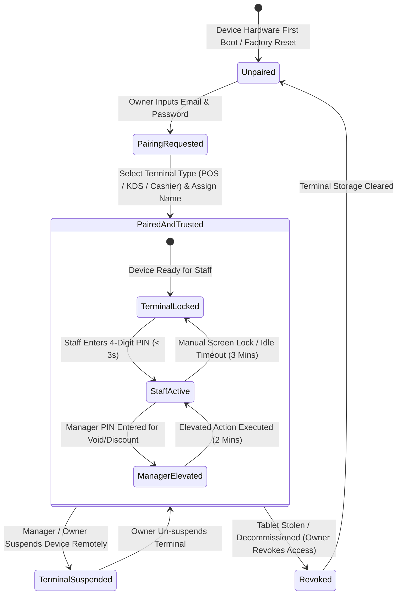

# Trinetra Restaurant OS — Milestone 2: Terminal-Centric Authentication Specification (v3 - Frozen)

> [!IMPORTANT]
> **Document Status**: **FROZEN SPECIFICATION** (Milestone 2 — Step 1: Specification)  
> **Source of Truth Alignment**: [AGENTS.md](file:///c:/Users/ASUS/OneDrive/Desktop/Trinetra%20digital/AGENTS.md), [docs/DEVELOPMENT_BACKLOG.md](file:///c:/Users/ASUS/OneDrive/Desktop/Trinetra%20digital/docs/DEVELOPMENT_BACKLOG.md), & [docs/SYSTEM_ARCHITECTURE.md](file:///c:/Users/ASUS/OneDrive/Desktop/Trinetra%20digital/docs/SYSTEM_ARCHITECTURE.md)  
> **Core Architectural Paradigm**: **Terminal-Centric Authentication** (Inspired by enterprise restaurant POS systems like Toast POS, Square POS, and Lightspeed). The physical terminal device is the primary trusted security boundary. Owners log in rarely; staff switch user contexts hundreds of times daily via 4-digit Quick PINs.

---

## 1. Permanent Authentication Principles

Every security and authentication implementation decision in Trinetra Restaurant OS is governed by these 7 non-negotiable principles:

1. **Trust the Device First**: Hardware terminals must be paired, registered, and authorized by the Owner before operational traffic is accepted.
2. **Trust the Authenticated Staff Second**: Staff PINs unlock transient operational contexts on already-trusted terminal hardware.
3. **Never Trust the Client**: Inputs, roles, prices, and claims sent by client devices are re-validated server-side on every request.
4. **Context Bound to Every Request**: Every single API request MUST explicitly carry `tenant_id` and `branch_id` context.
5. **Multi-Layer Enforcement**: Authorization checks execute sequentially at Edge Middleware, Application Routes, and Database engine levels.
6. **Database RLS is the Final Failsafe**: Row Level Security policies enforce multi-tenant and branch data isolation even if application code fails.
7. **Human Attribution for Every Action**: Every mutation affecting orders, financial totals, or inventory must be attributed to an identified human actor.

---

## 2. Terminal Identity & Device Metadata Specification

Every hardware terminal paired to a restaurant branch possesses immutable identity attributes to support hardware management and auditing:

### Terminal Metadata Model

| Metadata Field | Type / Format | Purpose & Description |
|----------------|---------------|-----------------------|
| `terminal_id` | UUID v4 | Immutable, system-generated unique identity for the physical device. |
| `terminal_name` | String (e.g., *"Main Hall Tablet 1"*) | Human-readable name configured by Owner during initial pairing. |
| `terminal_type` | Enum (`FloorPOS`, `CashierPOS`, `KitchenKDS`, `ManagerMobile`) | Defines the UI mode, available routes, and default screen layout. |
| `tenant_id` | UUID v4 | Organization identity to which the terminal belongs. |
| `branch_id` | UUID v4 | Physical branch location where the terminal physically operates. |
| `paired_at` | Timestamptz | Exact database timestamp when initial pairing was completed. |
| `paired_by` | UUID v4 (User ID) | Staff ID of the Restaurant Owner or Manager who executed the pairing. |
| `last_seen_at` | Timestamptz | Auto-updated on every WebSocket ping or API request to monitor device status. |
| `app_version` | String (e.g., *"v1.2.0"*) | Tracks frontend application release version running on the hardware. |
| `device_fingerprint` | String (Cryptographic Hash) | Hashes browser user-agent, screen dimensions, and hardware characteristics to detect cloned tokens. |
| `status` | Enum (`Active`, `Suspended`, `Revoked`) | Current operational status governed by the Owner/Manager. |

---

## 3. The 4 Distinct Session Types Architecture

To ensure strict separation of concerns, the OS manages four isolated session types, each with its own lifecycle, storage location, and responsibilities:

```mermaid
graph TD
    subgraph 1. Device Session (Hardware Anchor)
        S1[HttpOnly Device Cookie / 30 Days]
    end

    subgraph 2. Owner Admin Session (Governance)
        S2[Supabase Auth JWT / 24 Hours]
    end

    subgraph 3. Staff Session (Shift Operations)
        S3[In-Memory Staff Claims / 15 Mins / Idle 3m]
    end

    subgraph 4. Manager Elevation Session (Overrides)
        S4[In-Memory Transient Token / 2 Mins]
    end

    S1 -->|Anchors Terminal| S3
    S2 -->|Pairs & Manages| S1
    S3 -->|Requests High Discount/Void| S4
```

### Session Comparison Matrix

| Attribute | 1. Device Session | 2. Owner Admin Session | 3. Staff Session | 4. Manager Elevation Session |
|-----------|-------------------|------------------------|------------------|------------------------------|
| **Target User** | Physical Hardware Terminal | Restaurant Owner | Waiter, Cashier, Kitchen Staff | Shift Manager / Owner |
| **Credentials** | Device Pairing Token | Email + Password | 4-to-6 Digit Staff PIN | 4-to-6 Digit Manager PIN |
| **Lifespan** | 30 Days (Auto-renewed on ping) | 24 Hours | 15 Mins (Auto-lock after 3m idle) | 2 Minutes (Single action window) |
| **Storage Location** | `HttpOnly`, `Secure` Cookie | `HttpOnly` Auth Cookie | In-Memory (Zustand Store) | In-Memory (Transient React state) |
| **Primary Duty** | Authorizes hardware device to communicate with branch. | System config, staff setup, corporate sales reports, terminal pairing. | Taking orders, seating tables, viewing KDS feeds, cashier payments. | Approving >20% discounts, voids, comps, refunds, waste logs. |
| **Destruction Trigger**| Owner clicks "Revoke Device" from admin phone dashboard. | Owner clicks "Logout" or password changed. | Screen lock button, 3m idle timeout, staff switch. | Action executed or 2-minute timer expires. |

---

## 4. Complete Terminal Lifecycle State Machine



---

## 5. Operational Specification Answers (The 15 Core Questions)

### Question 1: What is the lifecycle of a trusted terminal?
- **States**: `Unpaired` → `PairedAndTrusted` (Operational) → `TerminalLocked` → `StaffActive` → `ManagerElevated` → `TerminalSuspended` → `Revoked`.
- **Operational Reality**: Once paired, a terminal remains in `PairedAndTrusted` across days, weeks, or months. Staff interact exclusively with `TerminalLocked` and `StaffActive`. The terminal never requires the Owner's email password for daily shift operations.

### Question 2: How is a terminal paired?
- **Step 1**: Hardware device navigates to `/init-terminal`.
- **Step 2**: Owner inputs Email + Password administrative credentials.
- **Step 3**: Owner selects Branch, inputs `terminal_name`, and chooses `terminal_type` (`FloorPOS`, `CashierPOS`, `KitchenKDS`, `ManagerMobile`).
- **Step 4**: System generates `terminal_id`, stores device metadata, and issues an encrypted `Terminal Registration Token` cookie bound to `tenant_id` and `branch_id`.
- **Step 5**: Terminal transitions to `TerminalLocked` PIN screen.

### Question 3: How is a terminal revoked?
- **Self-Service Revocation**: Owner/Manager opens *Device Management* dashboard on phone/laptop and clicks **Revoke Access** next to terminal name.
- **Backend Execution**: Server sets `terminal_status = 'Revoked'` in database.
- **Immediate Rejection**: Next request or WebSocket ping rejects the device token. Terminal purges local cache and resets to `Unpaired` setup screen.

### Question 4: What happens if a tablet is stolen?
- **Immediate Revocation**: Owner revokes device token from mobile phone.
- **Zero Data Exposure**: Tablet stores **zero credit card info, zero database keys, zero email passwords, and zero persistent PINs**.
- **In-Memory Lock**: In-memory staff JWT expires within 15 minutes. Stolen device is completely useless to an attacker.

### Question 5: Can one waiter log out without affecting another terminal?
- **Yes, 100% Independent**. Each tablet has a distinct `terminal_id` and in-memory staff claims context. Waiter A locking Tablet 1 has zero impact on Waiter B using Tablet 2.

### Question 6: Can multiple terminals be active simultaneously?
- **Yes**. Multiple terminals operate concurrently (e.g., 4 Waiter Tablets, 1 Fixed Cashier Terminal, 2 Kitchen KDS Screens), syncing live state via Supabase Realtime WebSockets.

### Question 7: How do kitchen displays (KDS) authenticate?
- **Dedicated KDS Mode**: Owner pairs device as `KitchenKDS`. KDS terminals require **zero daily PIN entry**. They continuously display the live ticket feed. Permissions are restricted to `READ` tickets, `UPDATE` prep status (`preparing` → `ready`), and toggle `menu.item.availability_changed` (86'd items). KDS terminals **cannot** access billing or sales totals.

### Question 8: What survives browser refresh?
- **Survives Refresh**: Terminal Pairing Cookie (Terminal remains trusted), Terminal Metadata (`terminal_id`, `branch_id`, `terminal_type`), Active Cart Draft (IndexedDB).
- **Does NOT Survive Refresh**: In-memory staff claims context. Refresh safely returns screen to `TerminalLocked` PIN screen (< 3s re-entry).

### Question 9: What survives logout / terminal lock?
- **Terminal Lock**: Terminal remains 100% paired and trusted. Active table sessions and kitchen tickets remain untouched. Only current staff member's in-memory claims are cleared.
- **Terminal Revocation**: Device cookie destroyed, local cache purged, device reverts to `Unpaired` state.

### Question 10: What survives restaurant restart / night closure?
- **Survives Night Closure**: Device pairing status, staff accounts & PIN hashes, menu/floor/recipe configs, closed invoices, financial audit logs.
- **Reset at EOD**: Active staff PIN sessions cleared (all terminals enter `TerminalLocked`), daily order sequence counters reset.

### Question 11 & 12: Storage Location & Credential Matrix

| Credential / Data Item | Storage Location | Encryption / Security | Persistence |
|------------------------|------------------|-----------------------|-------------|
| **Owner Password** | Supabase Auth DB | Argon2id / bcrypt hash | Permanent DB |
| **Staff Quick PIN** | PostgreSQL `restaurant_staff` | SHA-256 + Unique Branch Salt | Permanent DB |
| **Terminal Device Token** | Browser Cookie | Encrypted, `HttpOnly`, `SameSite=Strict` | 30 Days (Auto-renewed) |
| **Active Staff Claims JWT** | Zustand In-Memory Store | Signed JWT | 15 Mins / 3m Idle |
| **Manager Elevation Token** | Zustand Transient Memory | Signed Short-Lived Claim | 2 Minutes |
| **Raw PIN Keypad Entry** | React Component State | Cleared on Submit | Transient |

### Question 13: What requires Owner Email/Password login?
- Initial terminal device pairing (`/init-terminal`).
- Revoking paired terminals or generating new device tokens.
- Creating/editing Organization legal details, GSTIN, FSSAI numbers.
- Deleting staff accounts or modifying branch ownership.

### Question 14: What requires ONLY Manager PIN elevation?
- Discounts > threshold (> 20% or > ₹500).
- Voiding/cancelling items after kitchen dispatch.
- Complimentary ("Comp") bill approval.
- Voiding closed invoices / issuing refunds.
- Manual inventory stock adjustments and waste overrides.
- Unlocking a terminal after PIN lockout.

### Question 15: What requires ONLY Staff PIN entry?
- Unlocking paired terminal screen (< 3s).
- Seating tables and entering guest counts.
- Taking dine-in and takeaway orders.
- Adding items, modifiers, and special notes.
- Sending orders to kitchen.
- Printing bill previews.
- Recording cash/card/UPI payments (Cashier role).
- Toggling 86'd items (Kitchen role).

---

## 6. Comprehensive Auth Audit Event Taxonomy

Every security and authentication operation generates an immutable log entry in `audit_logs`:

```json
{
  "eventId": "aud_12345678-e89b-12d3-a456-426614174000",
  "eventType": "auth.staff.pin_login_failed",
  "timestamp": "2026-08-04T10:59:00.000Z",
  "tenantId": "11111111-1111-1111-1111-111111111111",
  "branchId": "22222222-2222-2222-2222-222222222222",
  "terminalId": "term_33333333-3333-3333-3333-333333333333",
  "actorId": "staff_44444444-4444-4444-4444-444444444444",
  "actorRole": "waiter",
  "ipAddress": "192.168.1.50",
  "metadata": {
    "failedAttemptsCount": 3,
    "lockoutTriggered": false,
    "reason": "Invalid 4-digit PIN entered"
  }
}
```

### Mandated Auth Audit Events

1. **`auth.terminal.paired`**: Recorded when Owner pairs a new device (Captures `terminal_name`, `terminal_type`, `paired_by`).
2. **`auth.terminal.revoked`**: Recorded when Owner revokes a device (Captures `revoked_by`, `reason`).
3. **`auth.owner.login`**: Recorded when Owner logs in via Email/Password.
4. **`auth.staff.pin_login`**: Recorded on successful staff PIN entry.
5. **`auth.staff.pin_failed`**: Recorded on incorrect PIN entry (Captures attempt count).
6. **`auth.terminal.brute_force_locked`**: Recorded when terminal exceeds 5 failed attempts (Enforces 15-minute lock).
7. **`auth.manager.elevation_granted`**: Recorded when Manager PIN is entered for an override (Captures `action_requested`, `approver_id`).
8. **`auth.terminal.unlocked`**: Recorded when staff unlocks a terminal.
9. **`auth.terminal.auto_locked`**: Recorded when 3-minute idle timer locks the screen.
10. **`auth.staff.logged_out`**: Recorded when staff manually locks or switches user.

---

## 7. Future Architectural Compatibility Proofs

This terminal-centric model is designed to support future SaaS roadmap items without architectural rewrites:

- **Customer Self-Signup (Future)**: When self-signup is implemented, the signup wizard creates the `Organization`, `Branch`, and `Owner` user, then redirects directly to `/init-terminal` for device pairing. Zero auth redesign needed.
- **Subscription Engine (Future)**: The `Device Session` token validation checks `tenant_status = 'active'` on heartbeat. If a subscription expires, terminals display a "Subscription Paused" screen.
- **Multiple Branches per Owner (Future)**: The Owner's Administrative session allows selecting which Branch to pair during `/init-terminal`. Once paired, the terminal is locked to that specific branch.
- **Multiple Restaurants per Owner (Future)**: The Owner login lists all owned `Organizations`. Pairing binds the device to the selected `tenant_id` and `branch_id`.
- **Offline Synchronization (Future)**: Hardware terminals store paired device keys in local IndexedDB. During offline periods, staff PINs can be verified locally against a hashed offline staff store.
- **Mobile Apps (Future)**: Android/iOS native POS apps store the `Terminal Registration Token` in secure device keychains (Android Keystore / iOS Keychain) instead of browser cookies.

---

## Appendix A — Authentication Design Assumptions

This specification explicitly relies on the following operational and technical assumptions:

1. **Strict Single-Branch Terminal Binding**: Every paired hardware terminal belongs to exactly one `branch_id`. A terminal cannot operate across multiple branches simultaneously.
2. **Re-pairing Required to Switch Branches**: Moving a physical tablet to a different branch requires an explicit device revocation and new Owner pairing flow.
3. **Single Active Staff Context Per Terminal**: A staff member may use multiple terminals throughout the day, but any single terminal has exactly one active staff context at any given moment.
4. **Transient Nature of Manager Elevation**: Manager PIN elevation never replaces or mutates the active waiter/cashier staff session; it grants a temporary 2-minute privilege escalation for a specific transaction only.
5. **Revocable Long-Lived Pairing Tokens**: Device pairing tokens are long-lived (30 days) to survive shifts and restarts, but remain strictly revocable server-side at any instant.
6. **Zero Plaintext PIN Storage or Logging**: Staff PINs are never stored, transmitted in logs, or rendered in UI screens in plaintext. All DB storage uses SHA-256 with unique per-branch salts.
7. **Compulsory 5-Claim Context**: Every authenticated operational API request MUST carry `tenant_id`, `branch_id`, `terminal_id`, `staff_id` (when unlocked), and `user_role` claims.
8. **Layered Authorization Responsibility**: Authentication establishes identity; RBAC determines permissions; PostgreSQL Row Level Security (RLS) is the final, un-bypassable authorization boundary.

---

## Out of Scope

To prevent feature creep, this specification intentionally does **NOT** design or implement the following capabilities, which belong to future engineering milestones:

- **OAuth / Social Login** (Google, Apple, Microsoft logins are excluded; restaurants use email/password + PINs).
- **Single Sign-On (SSO) / SAML** (Enterprise SSO is deferred to future multi-location SaaS extensions).
- **Biometric Authentication** (Fingerprint / Face ID scanner integrations are out of scope).
- **Offline Authentication Sync Mechanisms** (Local offline PIN verification implementation details belong to the Future Offline Milestone).
- **Subscription Engine & Payment Billing Gateways** (Saas subscription status checks are out of scope).
- **Customer Self-Ordering & Guest Authentication** (QR code table ordering by customers is out of scope).
- **Public API Keys & Third-Party Integrations** (API keys for external delivery aggregators are out of scope).
- **Third-Party Identity Providers** (Auth0, Okta, Firebase Auth are excluded; platform uses Supabase Auth + Postgres native schemas).

---

> [!IMPORTANT]
> **M2_AUTHENTICATION_SPEC.md IS PERMANENTLY FROZEN.**  
> Saved at [`docs/milestones/M2_AUTHENTICATION_SPEC.md`](file:///c:/Users/ASUS/OneDrive/Desktop/Trinetra%20digital/docs/milestones/M2_AUTHENTICATION_SPEC.md).
