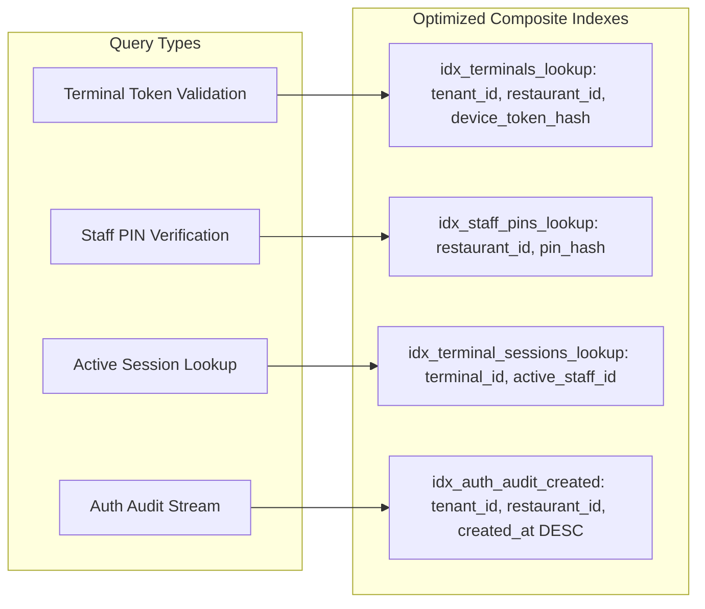
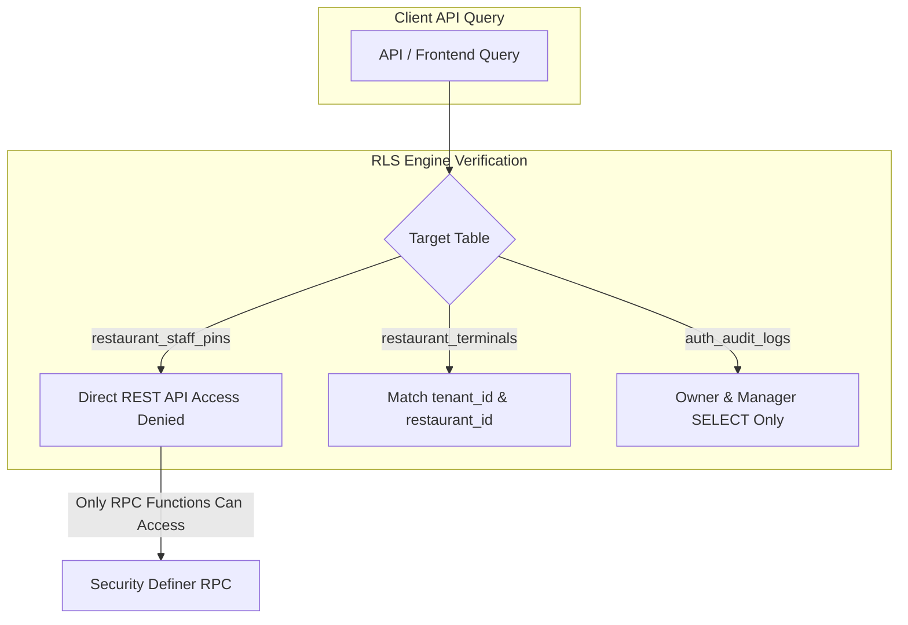

# Trinetra Restaurant OS — Milestone 2: Database Strategy & Data Model

> [!IMPORTANT]
> **Document Status**: Draft for Review (Milestone 2 — Step 2: Database Strategy)  
> **Source of Truth Alignment**: [AGENTS.md](file:///c:/Users/ASUS/OneDrive/Desktop/Trinetra%20digital/AGENTS.md), [docs/DEVELOPMENT_BACKLOG.md](file:///c:/Users/ASUS/OneDrive/Desktop/Trinetra%20digital/docs/DEVELOPMENT_BACKLOG.md), & [docs/milestones/M2_AUTHENTICATION_SPEC.md](file:///c:/Users/ASUS/OneDrive/Desktop/Trinetra%20digital/docs/milestones/M2_AUTHENTICATION_SPEC.md)  
> **Note**: This document specifies the logical data entities, relationships, constraints, indexing, atomic RPC functions, and Row Level Security (RLS) rules for Milestone 2 **without writing executable SQL migration code**.

---

## 1. Database Model Overview & Entity Relationship Diagram

Milestone 2 introduces 5 dedicated logical database entities to support terminal-centric authentication:
1. `restaurant_terminals` (Hardware device registration & pairing tokens)
2. `restaurant_staff` (Staff profiles, roles, employment status)
3. `restaurant_staff_pins` (1-to-1 extension storing salted PIN hashes, attempt counters, and lockout timestamps)
4. `terminal_sessions` (Active terminal heartbeats and in-memory staff claim tracking)
5. `auth_audit_logs` (Append-only audit trail for authentication, pairing, and elevation events)

```mermaid
erDiagram
    TENANTS ||--o{ RESTAURANTS : owns
    RESTAURANTS ||--o{ RESTAURANT_TERMINALS : registers
    RESTAURANTS ||--o{ RESTAURANT_STAFF : employs
    RESTAURANT_STAFF ||--|| RESTAURANT_STAFF_PINS : has
    RESTAURANT_TERMINALS ||--o{ TERMINAL_SESSIONS : hosts
    RESTAURANTS ||--o{ AUTH_AUDIT_LOGS : records

    RESTAURANT_TERMINALS {
        uuid id PK
        uuid tenant_id FK
        uuid restaurant_id FK
        string terminal_name
        string terminal_type
        string device_token_hash
        string status
        timestamptz last_seen_at
    }

    RESTAURANT_STAFF {
        uuid id PK
        uuid tenant_id FK
        uuid restaurant_id FK
        string name
        string role
        boolean is_active
    }

    RESTAURANT_STAFF_PINS {
        uuid staff_id PK_FK
        string pin_hash
        string salt
        int failed_attempts
        timestamptz locked_until
    }

    TERMINAL_SESSIONS {
        uuid id PK
        uuid terminal_id FK
        uuid active_staff_id FK
        timestamptz last_active_at
    }

    AUTH_AUDIT_LOGS {
        uuid id PK
        uuid tenant_id FK
        uuid restaurant_id FK
        uuid terminal_id FK
        uuid actor_id FK
        string event_type
        jsonb metadata
    }
```

---

## 2. Detailed Logical Entity Specifications

### 2.1 Entity: `restaurant_terminals`
- **Purpose**: Stores hardware devices paired to a specific restaurant branch.
- **Attributes**:
  - `id`: Primary Key (UUID v4)
  - `tenant_id`: Foreign Key → `tenants(id)` (CASCADE)
  - `restaurant_id`: Foreign Key → `restaurants(id)` (CASCADE) — *Represents Branch ID*
  - `terminal_name`: Text (e.g., *"Main Hall Tablet 1"*)
  - `terminal_type`: Text Check (`'FloorPOS'`, `'CashierPOS'`, `'KitchenKDS'`, `'ManagerMobile'`)
  - `device_token_hash`: Text (SHA-256 hash of long-lived device token, UNIQUE)
  - `device_fingerprint`: Text (Hardware/browser characteristics hash)
  - `status`: Text Check (`'Active'`, `'Suspended'`, `'Revoked'`)
  - `app_version`: Text (e.g., *"v1.2.0"*)
  - `paired_by`: Foreign Key → `users(id)` (Owner/Manager who paired)
  - `paired_at`: Timestamptz (Default `now()`)
  - `last_seen_at`: Timestamptz (Auto-updated on ping)

---

### 2.2 Entity: `restaurant_staff`
- **Purpose**: Represents staff members employed at a specific branch.
- **Attributes**:
  - `id`: Primary Key (UUID v4)
  - `tenant_id`: Foreign Key → `tenants(id)` (CASCADE)
  - `restaurant_id`: Foreign Key → `restaurants(id)` (CASCADE) — *Represents Branch ID*
  - `name`: Text (Full Staff Name)
  - `phone`: Text (Optional contact)
  - `role`: Text Check (`'owner'`, `'manager'`, `'cashier'`, `'waiter'`, `'kitchen'`, `'inventory'`, `'accountant'`)
  - `is_active`: Boolean (Default `true`)
  - `created_at`: Timestamptz (Default `now()`)
  - `updated_at`: Timestamptz (Default `now()`)

---

### 2.3 Entity: `restaurant_staff_pins` (Security-Isolated Extension)
- **Purpose**: Isolated table holding 4-digit PIN credentials and lockout controls. Keeping PIN hashes isolated from the primary `restaurant_staff` table prevents accidental exposure in staff dropdown APIs.
- **Attributes**:
  - `staff_id`: Primary Key & Foreign Key → `restaurant_staff(id)` (CASCADE)
  - `pin_hash`: Text (SHA-256 hash of `raw_pin + salt`)
  - `salt`: Text (Unique 32-character random salt generated per staff member)
  - `failed_attempts`: Integer (Default `0`)
  - `locked_until`: Timestamptz (Null when unlocked; set to `now() + 15 mins` when attempts exceed 5)
  - `updated_at`: Timestamptz (Default `now()`)

---

### 2.4 Entity: `terminal_sessions`
- **Purpose**: Manages transient heartbeat state and active staff context per physical terminal.
- **Attributes**:
  - `id`: Primary Key (UUID v4)
  - `tenant_id`: Foreign Key → `tenants(id)` (CASCADE)
  - `restaurant_id`: Foreign Key → `restaurants(id)` (CASCADE)
  - `terminal_id`: Foreign Key → `restaurant_terminals(id)` (CASCADE, UNIQUE per device)
  - `active_staff_id`: Foreign Key → `restaurant_staff(id)` (NULL when terminal locked)
  - `active_role`: Text (Current unlocked staff role)
  - `last_active_at`: Timestamptz (Used for 3-minute auto-lock verification)
  - `created_at`: Timestamptz (Default `now()`)

---

### 2.5 Entity: `auth_audit_logs`
- **Purpose**: Immutable log for all authentication, pairing, elevation, and security events.
- **Attributes**:
  - `id`: Primary Key (UUID v4)
  - `tenant_id`: Foreign Key → `tenants(id)` (CASCADE)
  - `restaurant_id`: Foreign Key → `restaurants(id)` (CASCADE)
  - `terminal_id`: Foreign Key → `restaurant_terminals(id)` (SET NULL)
  - `actor_id`: Foreign Key → `restaurant_staff(id)` (SET NULL)
  - `actor_role`: Text
  - `event_type`: Text (e.g., `'auth.terminal.paired'`, `'auth.staff.pin_login'`, `'auth.staff.pin_failed'`, `'auth.terminal.brute_force_locked'`, `'auth.manager.elevation_granted'`)
  - `ip_address`: Text
  - `metadata`: JSONB (Stores attempt counts, reason notes, and approver details)
  - `created_at`: Timestamptz (Default `now()`)

---

## 3. Database Constraints & Invariants

1. **Unique Device Token**: `device_token_hash` MUST be globally unique across all terminals.
2. **Unique Branch PIN Hash**: `(restaurant_id, pin_hash)` MUST be unique within a single branch (two staff members at the same branch cannot share the exact same 4-digit PIN).
3. **Unique Active Terminal Session**: `terminal_id` in `terminal_sessions` MUST be unique (one session entry per physical device).
4. **Mandatory Tenant & Branch Binding**: `tenant_id` and `restaurant_id` MUST be present on all entities without exception.
5. **Staff Role Validation**: Role MUST strictly match one of the 7 predefined system roles.

---

## 4. High-Performance Indexing Strategy

To guarantee sub-10ms PIN authentication and terminal validation, indexes utilize compound tenant/branch prefixing:



### Index Inventory
- **`idx_terminals_lookup`**: `(tenant_id, restaurant_id, device_token_hash) WHERE status = 'Active'`
- **`idx_staff_pins_lookup`**: `(restaurant_id, pin_hash)`
- **`idx_staff_branch`**: `(tenant_id, restaurant_id, is_active)`
- **`idx_terminal_sessions`**: `(terminal_id)`
- **`idx_auth_audit_logs`**: `(tenant_id, restaurant_id, created_at DESC)`

---

## 5. Security Definer RPC Functions Strategy

To eliminate security risks and race conditions, PIN verification and terminal pairing execute inside atomic **PostgreSQL Security Definer RPC Functions**:

### 5.1 Function: `verify_staff_pin_rpc`
- **Execution Flow**:
  1. Accepts `p_branch_id`, `p_device_token`, `p_pin_input`.
  2. Validates terminal device token is active.
  3. Locates staff member matching `(branch_id, SHA256(p_pin_input + salt))`.
  4. Checks `locked_until` timestamp. If locked, rejects request and logs audit event.
  5. If PIN is invalid: Increments `failed_attempts`. If `failed_attempts >= 5`, sets `locked_until = now() + 15 mins` and logs `auth.terminal.brute_force_locked`.
  6. If PIN is valid: Resets `failed_attempts = 0`, updates `terminal_sessions`, logs `auth.staff.pin_login`, and returns verified staff claims JWT context payload (`staff_id`, `role`, `name`).

### 5.2 Function: `pair_terminal_device_rpc`
- **Execution Flow**:
  1. Validates Owner authentication context.
  2. Inserts new record into `restaurant_terminals` with generated `device_token_hash`.
  3. Initializes `terminal_sessions` entry.
  4. Logs `auth.terminal.paired` audit event.
  5. Returns encrypted device pairing token.

---

## 6. Row Level Security (RLS) Strategy

Row Level Security is enabled on **100% of Milestone 2 tables**:



### Table-Specific RLS Policies

| Table Name | SELECT Policy | INSERT / UPDATE Policy | DELETE Policy |
|------------|---------------|------------------------|---------------|
| `restaurant_terminals` | `tenant_id = jwt_tenant AND restaurant_id = jwt_branch` | Owner & Manager Role Only | Owner Role Only (Soft Delete / Status Revoked preferred) |
| `restaurant_staff` | `tenant_id = jwt_tenant AND restaurant_id = jwt_branch` | Owner & Manager Role Only | Disabled (Set `is_active = false`) |
| `restaurant_staff_pins` | **STRICT DENY** (Accessible ONLY by `verify_staff_pin_rpc`) | **STRICT DENY** (Managed via Admin RPC) | **STRICT DENY** |
| `terminal_sessions` | `tenant_id = jwt_tenant AND restaurant_id = jwt_branch` | System & Active Staff Context | System Only |
| `auth_audit_logs` | Owner & Manager Role Only | System RPC Insert Only | **STRICT DENY** (Immutable log) |

---

## 7. Atomic Transaction Boundaries

All authentication mutations execute within explicit atomic database transactions:
- **Terminal Pairing Transaction**: `Insert Terminal` + `Create Session Entry` + `Write Audit Log` → Commit or Rollback.
- **PIN Verification Transaction**: `Check Lockout` + `Evaluate PIN Hash` + `Update Failed Counters` + `Update Terminal Session` + `Write Audit Log` → Commit or Rollback.
- **Terminal Revocation Transaction**: `Update Terminal Status = Revoked` + `Clear Terminal Session` + `Write Audit Log` → Commit or Rollback.

---

## 8. Summary & Next Architectural Steps

This `M2_DATABASE_STRATEGY.md` document completes the database architectural design for Milestone 2:
- Specifies 5 logical database entities without writing DDL code.
- Establishes a complete isolation pattern for staff PIN credentials (`restaurant_staff_pins`).
- Defines composite indexing patterns for sub-10ms PIN logins and device validation.
- Formalizes atomic Security Definer RPC functions for PIN checking and terminal pairing.
- Enforces strict RLS policies, including complete REST API denial for sensitive PIN storage.

---

> [!NOTE]
> **Next Recommended Step**: Upon your review and approval of this database design, we will proceed to write the clean, verified SQL migration file: `supabase/migrations/0016_restaurant_auth_system.sql`.
